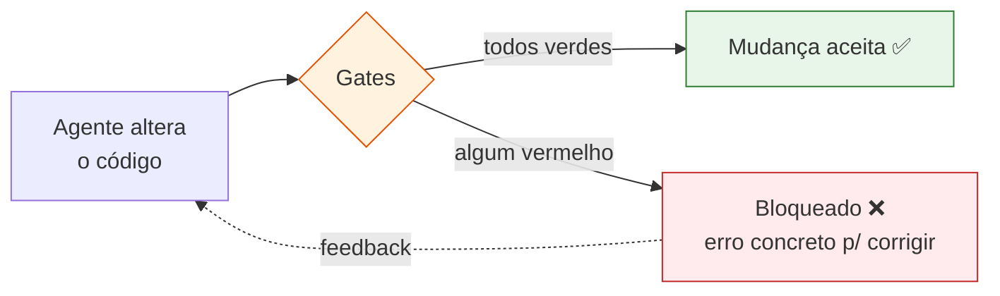
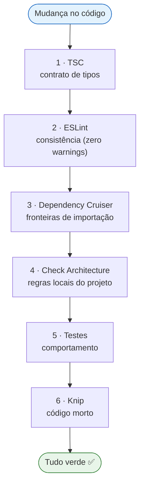
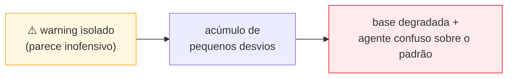
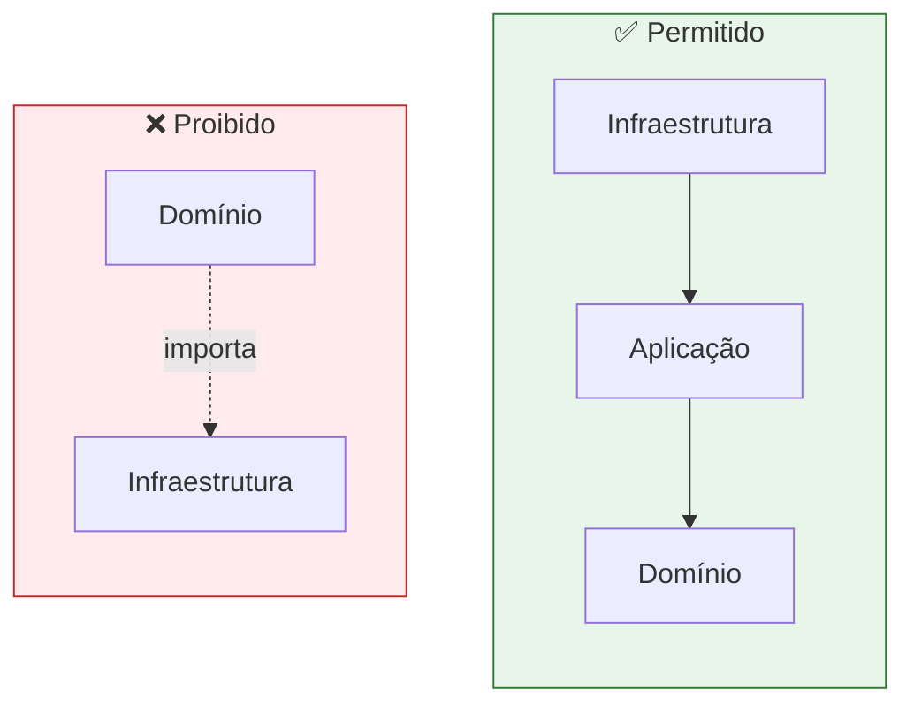
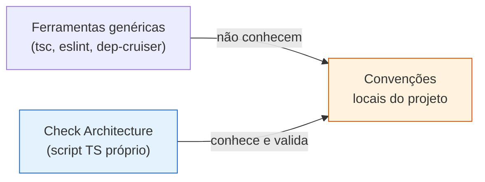
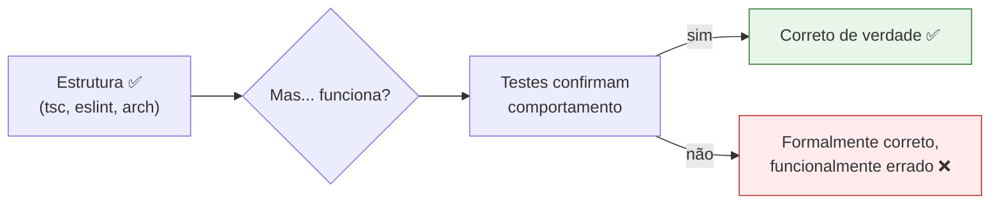
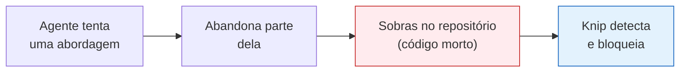
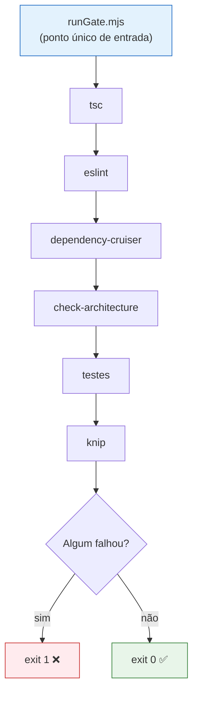
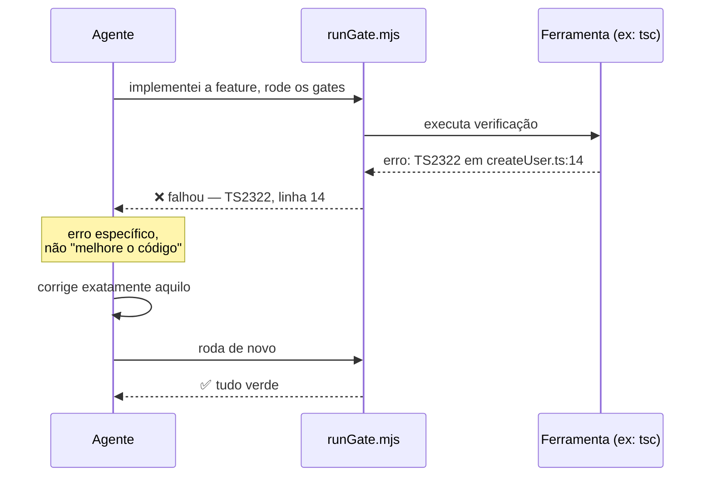

# Como Criar Gates

> **Resumo da aula em formato didático.** Este documento explica o que são *gates
> determinísticos*, por que eles importam num fluxo com agentes de IA e como montar uma
> cadeia de verificações automáticas — do contrato de tipos até o comportamento testado —
> orquestrada por um único ponto de entrada.

---

## A ideia central em uma frase

> Um **gate** é uma verificação automática com resposta objetiva e repetível: **passou** ou
> **falhou**. Nada de "achismo".

Pense no gate como a **catraca de um metrô**: ela não julga se você é "uma boa pessoa" — ela
verifica um critério objetivo (bilhete válido) e ou libera, ou bloqueia. Sempre igual, sem
interpretação.

Em um fluxo com agentes, isso cria uma **fronteira operacional clara**: alterações no
projeto só são aceitas quando respeitam requisitos mínimos **verificáveis por script** — sem
depender da interpretação do LLM nem do julgamento humano sobre "qualidade percebida".



---

## Por que gates? O papel deles no projeto

Gerar código, alterar arquivos e implementar funcionalidades **aumenta o risco de
regressão** — tanto estrutural (a arquitetura "vaza") quanto comportamental (algo que
funcionava parou).

Os gates são **mecanismos internos de validação** que confirmam se a alteração ainda
respeita:

- 📜 **Contratos** (tipos, interfaces entre camadas)
- 🧱 **Limites arquiteturais** (quem pode depender de quem)
- ✅ **Critérios de qualidade** (consistência, comportamento)

> 🔑 **Importante:** o gate **não substitui** a revisão humana. Ele **reduz o espaço de erro
> objetivo** — e evita gastar tokens pedindo ao agente para "redescobrir" problemas que um
> script detecta localmente em segundos.

---

## A cadeia de gates (visão geral)

Cada gate cobre um tipo de problema diferente. Juntos, formam uma cadeia que vai do mais
básico (tipos) ao mais semântico (comportamento) e à higiene (código morto).



> A ordem importa: gates **mais baratos e mais básicos primeiro**. Não faz sentido rodar a
> suíte de testes se o código nem compila os tipos.

---

## 1. TSC — gate de contrato

O **TypeScript Compiler** (`tsc --noEmit`) é a verificação **mais básica** da cadeia. Ele
valida o código do ponto de vista de **tipos**, sem exigir build completo, detectando
incompatibilidades entre interfaces, implementações e contratos entre camadas.

```bash
tsc --noEmit
```

Quando esse gate falha, o problema já está **concreto o suficiente** para correção
imediata, sem análise subjetiva:

```text
src/application/createUser.ts:14:3 - error TS2322:
  Type 'string' is not assignable to type 'UserId'.
```

> 💡 Por ser barato e o mais fundamental, o TSC abre a cadeia. Se ele falha, nada além dele
> precisa rodar.

---

## 2. ESLint — tolerância zero a warnings

Aqui o ESLint **não é só estilo**: é um **mecanismo disciplinador de consistência**. A
chave é tratar **warning como erro**.

```bash
eslint . --max-warnings=0
```



**Por que ser rígido?** Em ambientes assistidos por IA, isso transforma **convenções em
restrições executáveis**. Um warning ignorado vira ruído que confunde o agente sobre qual é
o padrão esperado. Com `--max-warnings=0`, "a convenção" deixa de ser opcional.

---

## 3. Dependency Cruiser — guardião das fronteiras

Lembra das regras de dependência entre **domínio, aplicação, mundo externo e composition
root**? O **Dependency Cruiser** aplica essas regras no **nível das importações**.



Ele cobre um tipo de quebra que **não aparece na compilação**: o sistema continua
funcionando, mas a arquitetura **já foi violada** (ex.: o `domain` passou a importar algo de
`infrastructure`).

#### Exemplo de regra

```json
{
  "forbidden": [
    {
      "name": "no-domain-to-infra",
      "comment": "Domínio nunca pode depender de infraestrutura",
      "from": { "path": "^src/domain" },
      "to":   { "path": "^src/infrastructure" }
    }
  ]
}
```

---

## 4. Check Architecture — regras específicas do projeto

Nem toda regra arquitetural cabe em "quem importa quem". Um **script customizado** (em
TypeScript) valida restrições **particulares** do projeto que ferramentas genéricas não
conhecem. Exemplos:

| Regra do projeto | O que o script verifica |
|---|---|
| `process.env` só em `env.ts` | nenhum outro arquivo lê variáveis de ambiente direto |
| Composition root em `main.ts` | montagem de dependências concentrada num só lugar |
| Sem `try-catch` em handlers | handlers não engolem erros; tratamento é centralizado |



> Esse gate captura o conhecimento **tácito** do time, transformado em verificação
> executável — o que nenhuma ferramenta de prateleira saberia checar sozinha.

---

## 5. Testes automatizados — gate de comportamento

Compilação, lint e arquitetura validam **estrutura**. Os testes validam **comportamento**.



Eles confirmam que o que **já existia** continua funcionando (regressão) e que a
implementação **nova** atende ao que foi definido — mesmo com toda a cadeia estrutural
verde. Em fluxos com agentes, isso evita aceitar código **formalmente correto, mas
funcionalmente errado**.

---

## 6. Knip — remoção de código morto

O **Knip** procura os resíduos típicos de iteração:

- 🗑️ exports não usados
- 📄 arquivos órfãos
- 📦 dependências obsoletas
- 🏷️ tipos sem referência



Esse problema **cresce** quando o agente explora um caminho, abandona parte dele e deixa
sobras. Transformar o diagnóstico em gate mantém a base **enxuta** e reduz ruído para as
próximas gerações de código.

---

## Orquestração: um único ponto de entrada

Em vez de exigir que cada verificação seja rodada **manualmente**, centralize a sequência
num script — por exemplo, `runGate.mjs`.



**Vantagens do ponto único:**

- 📐 **Padroniza a ordem** de execução (barato → caro)
- 🧑‍💻 **Simplifica a rotina** do desenvolvedor (um comando só)
- 🤖 **Torna o processo explícito** para o harness
- ♻️ **Plugável** em automações locais, CI e execução pelo agente — o **mesmo** fluxo em todo lugar

#### Exemplo de uso

```bash
node runGate.mjs
# ou via package.json:  npm run gate
```

```json
{
  "scripts": {
    "gate": "node runGate.mjs"
  }
}
```

---

## Gates como feedback operacional para agentes

Aqui está o ganho que vai além de "bloquear". Quando o agente implementa uma feature e roda
os gates, a falha **deixa de ser abstrata** e vira um **erro concreto**, retornado por uma
ferramenta específica.



Esse retorno orienta a próxima correção **com muito mais precisão** do que um prompt
genérico pedindo "melhore o código". O gate, portanto, **fecha um ciclo de feedback
determinístico** que ajuda o agente a **convergir com menos custo** (menos tokens, menos
idas e vindas).

---

## Tabela-resumo dos gates

| # | Gate | Valida | Tipo de erro que pega |
|---|---|---|---|
| 1 | **TSC** | Contrato de tipos | incompatibilidade de tipos/interfaces |
| 2 | **ESLint** (`--max-warnings=0`) | Consistência | desvios de convenção acumulados |
| 3 | **Dependency Cruiser** | Fronteiras de importação | camada dependendo de outra indevidamente |
| 4 | **Check Architecture** | Regras locais do projeto | `process.env` fora de `env.ts`, etc. |
| 5 | **Testes** | Comportamento | código correto na forma, errado no efeito |
| 6 | **Knip** | Higiene | exports/arquivos/deps mortos |

---

## Checklist final — "minha cadeia de gates está pronta?"

- [ ] Cada gate produz resultado **objetivo e repetível** (passou/falhou), sem julgamento subjetivo?
- [ ] O **TSC** roda primeiro, como contrato de tipos mais básico?
- [ ] O **ESLint** está em **zero warnings** (`--max-warnings=0`)?
- [ ] O **Dependency Cruiser** codifica as regras de dependência entre camadas?
- [ ] Existe um **Check Architecture** para as regras locais que ferramentas genéricas não pegam?
- [ ] Os **testes** cobrem regressão e o comportamento novo?
- [ ] O **Knip** está plugado para barrar código morto?
- [ ] Tudo é orquestrado por um **ponto único de entrada** (`runGate.mjs`) reaproveitado em local, CI e agente?

> Quando todos os itens estiverem marcados, seus gates deixam de ser scripts soltos e
> passam a ser uma **fronteira operacional determinística** — bloqueando regressões e, ao
> mesmo tempo, **guiando o agente** com feedback preciso a cada iteração.
