# O Contrato de Feature (`contract.md`)

> **Resumo da aula em formato didático.** Este documento explica o papel do `contract.md`
> no fluxo SDD — um artefato que vai além de `spec.md` e `plan.md` e funciona como
> **referência operacional de execução e validação**. No fluxo, o `contract.md` é **gerado
> pelo `spec-writer`** (junto com `spec.md` + `plan.md`), **satisfeito pelo
> [implement-feature](../skills/implement-feature/SKILL.md)** e **consumido pela
> skill de validação [`evaluator`](./Skill_Evaluator.md)**, que age em conjunto com os testes
> automatizados. Ver o panorama em
> [Fluxo SDD e Implementação das Skills](./Fluxo_SDD_e_Implementacao_das_Skills.md).

---

## A ideia central em uma frase

> `spec.md` diz **o que** a feature é. `plan.md` diz **como** construí-la passo a passo.
> `contract.md` diz **em que condições** ela roda e **por quais evidências** será aceita.

Pense no `contract.md` como o **termo de aceite de uma obra**: antes de receber a casa, há
uma vistoria com checklist — água ligada, tomadas funcionando, portas alinhadas. Quem
construiu já sabia desses critérios; quem recebe consegue conferir item a item. O contrato
**conecta** três coisas que antes ficavam implícitas:

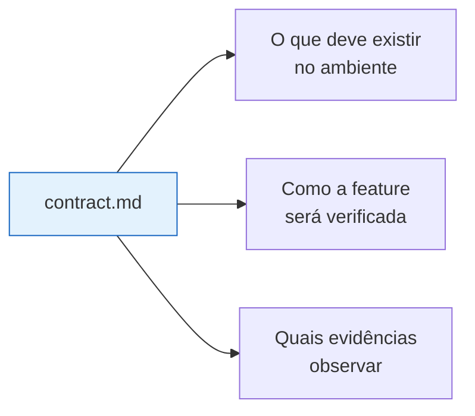

O resultado é **menos ambiguidade** — tanto para quem implementa quanto para quem avalia.

---

## Os três artefatos e seus papéis distintos

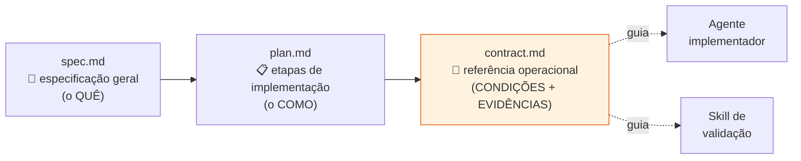

| Artefato | Responde | Foco |
|---|---|---|
| **`spec.md`** | O que a feature é? | Especificação geral |
| **`plan.md`** | Como construí-la? | Etapas de implementação |
| **`contract.md`** | Em que condições roda e como é aceita? | **Execução e validação** |

A novidade é que o `contract.md` **deixa de ser complemento** e passa a ser referência
operacional — o ponto de encontro entre **construção** e **validação**.

---

## 1. `contract.md` como contrato de ambiente

A primeira função do contrato é **explicitar os pré-requisitos mínimos** para que a feature
possa ser **executada e testada**.

### Exemplo: uma landing page pública

> 💡 Os exemplos a seguir usam uma **landing page genérica de uma aplicação web** apenas
> para ilustrar. Substitua pelos detalhes reais do seu projeto ao escrever o contrato.

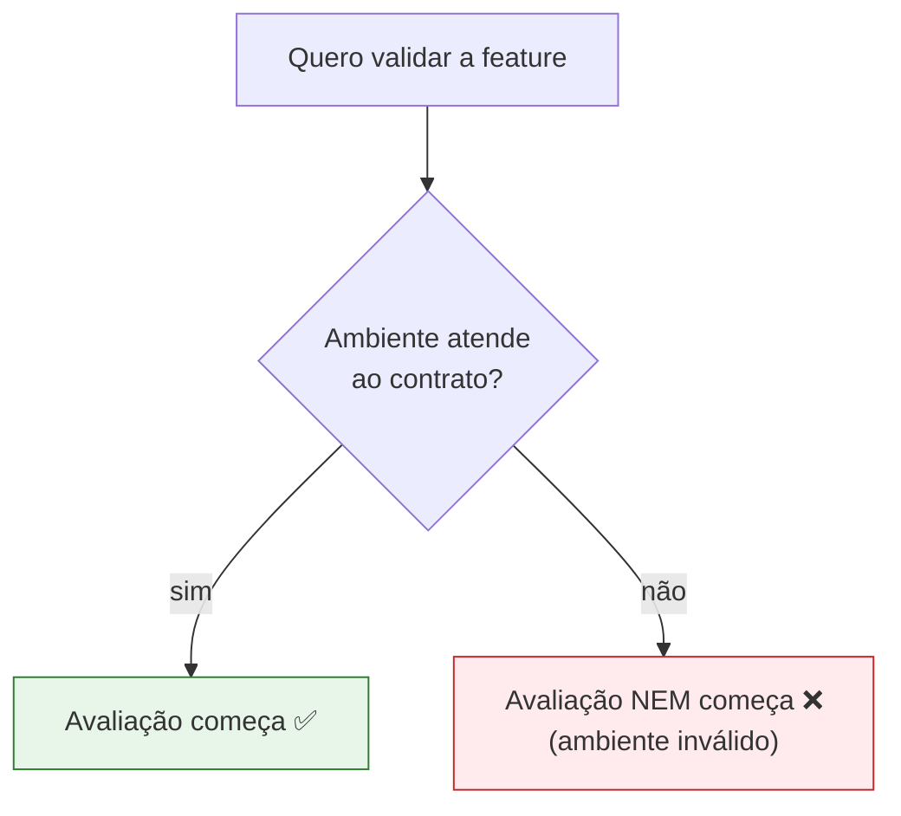

Para essa landing page, o contrato de ambiente exige:

| Pré-requisito | Detalhe |
|---|---|
| **Dev runtime da aplicação web** | ativo e servindo a rota `/` |
| **Browser real** | operado via `Playwright CLI` |

> 🔑 **Utilidade prática direta:** se o ambiente não atende ao contrato, **a avaliação nem
> começa** — o sistema não está em condições válidas de teste.

Em projetos mais complexos, esse mesmo documento precisa listar dependências adicionais:

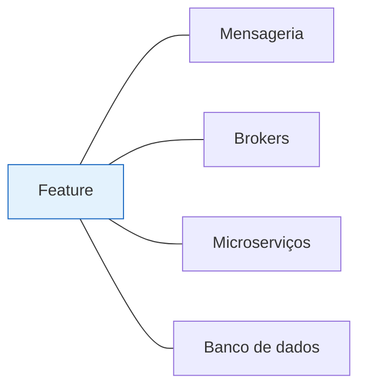

---

## 2. Checklist executável para terceiros

O contrato funciona como um **checklist entregável a alguém sem conhecimento prévio** do
sistema. Essa pessoa consegue verificar, sozinha, se possui runtime, serviços auxiliares e
ferramentas **antes** de tentar validar a feature.

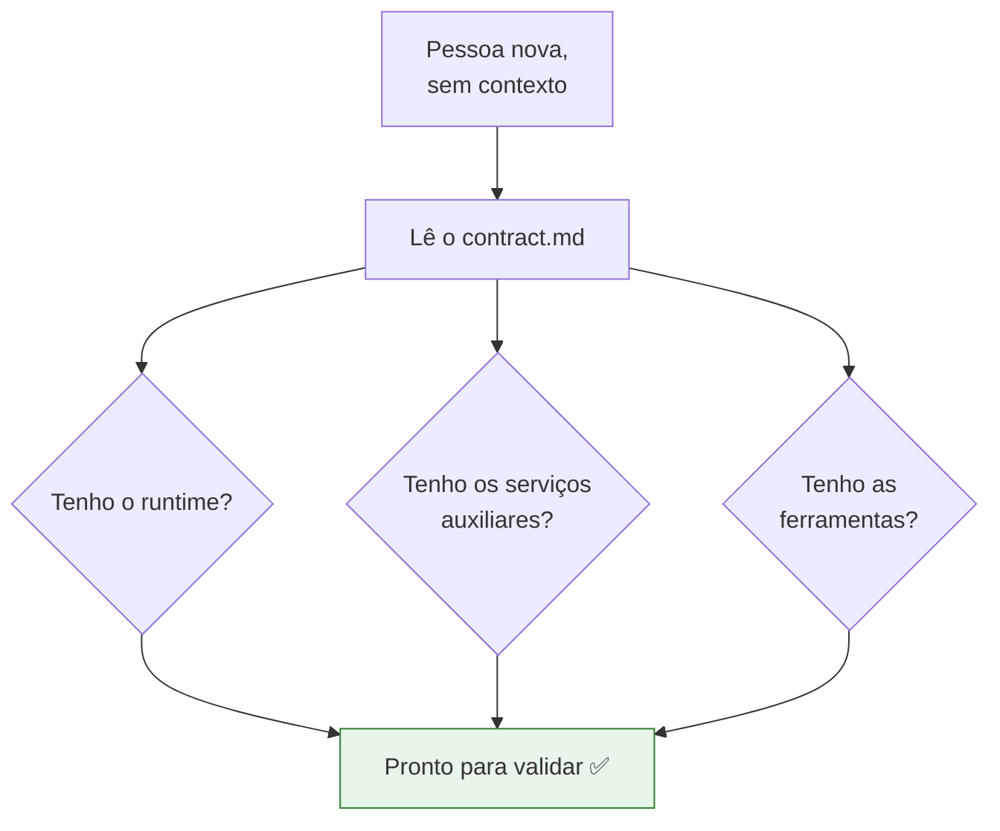

O ganho é transformar **conhecimento implícito do time em instruções explícitas e
auditáveis**.

> ⚠️ **Sem isso:** falhas de **ambiente** podem ser confundidas com falhas de
> **implementação** — e o agente (ou a pessoa) gasta esforço "corrigindo" um código que
> estava certo o tempo todo.

---

## 3. Gates de qualidade no contrato

Além do ambiente, o contrato registra os **gates de qualidade** que a feature precisa
satisfazer — um **piso técnico de aceitação** antes mesmo da inspeção funcional detalhada.

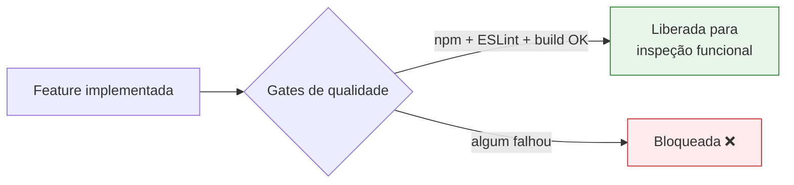

| Gate | Comando / verificação |
|---|---|
| **Execução** | rodar o projeto com `npm` |
| **Lint** | `ESLint` |
| **Build** | build do projeto |

> 💡 A consequência é que a validação **deixa de depender só de percepção visual** e passa a
> incluir **critérios objetivos de integridade do código**. Isso conecta o contrato à
> mesma filosofia dos [gates determinísticos](./Como_criar_gates.md).

---

## 4. Manifesto de cobertura

O **manifesto de cobertura** declara **o que** precisa ser verificado e **quem cobre** cada
parte da feature. No exemplo, a cobertura está associada à **UI da feature 01**,
identificada por um rótulo como `Public-01`.

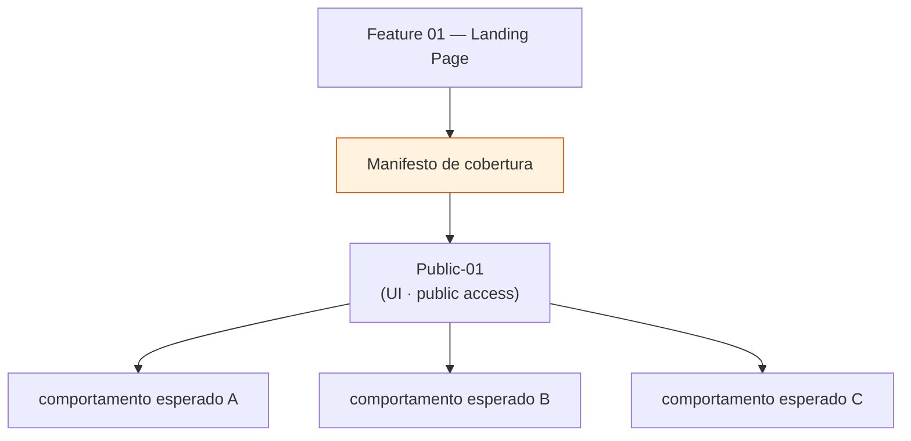

**Por que isso importa:** cada comportamento esperado passa a ter uma **superfície de
validação associada**, o que evita lacunas. Em vez de testar **"a página"** genericamente, o
contrato **delimita exatamente** quais aspectos da interface entram no escopo.

---

## 5. Surfaces e detalhamento de comportamento

A cobertura é organizada por **surfaces** — camadas ou áreas **observáveis** do sistema.
Cada surface parte de um **estado inicial** definido e descreve os comportamentos a
verificar.

### Surface de UI com `public access`

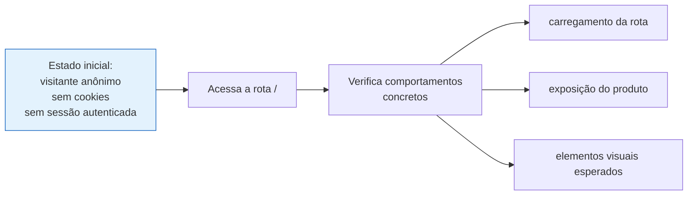

Essa estrutura aproxima o contrato de um **teste orientado a comportamento** (BDD), mas com
foco em **aceitação operacional** — não apenas "o teste passou", e sim "a feature se comporta
como deveria neste estado".

---

## 6. Critérios observáveis da landing page

A landing page **não** é validada por uma descrição vaga de "estar correta". Ela é validada
por **sinais observáveis** — cada item é uma **evidência verificável**.

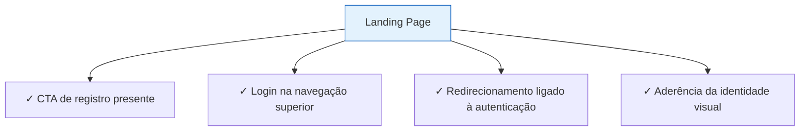

| Critério observável | Evidência de que a feature atende ao spec |
|---|---|
| **CTA de registro** | botão/link de cadastro presente e visível |
| **Login na navegação superior** | item de login no topo |
| **Redirecionamento de autenticação** | comportamento esperado ao clicar/autenticar |
| **Identidade visual** | aderência ao design definido |

> 📈 **Regra prática:** quanto **mais critérios de aceitação** existirem, **mais extenso e
> detalhado** o contrato tende a ficar. Isso é esperado — detalhamento é cobertura.

---

## 7. Guidance: o contrato orienta implementação E avaliação

Aqui está o ponto que fecha o ciclo. O contrato **não serve só para o avaliador final** —
ele também orienta o **agente implementador**.

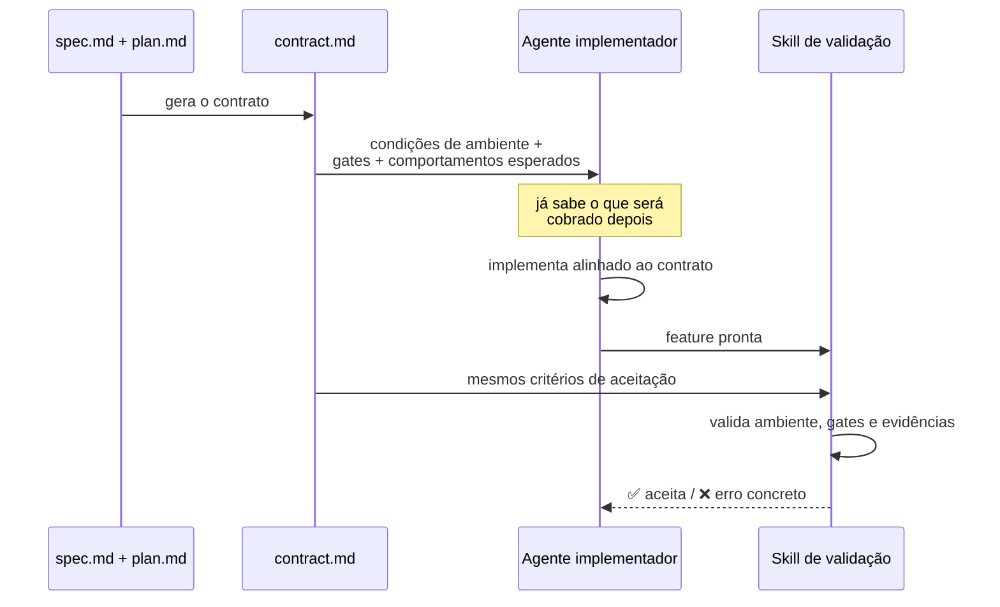

Quem implementa já sabe, **de antemão**:

- 🌐 quais **condições de ambiente** respeitar;
- ✅ quais **gates técnicos** passar;
- 👀 quais **comportamentos** serão cobrados depois.

Isso **alinha construção e validação em torno do mesmo documento** — especialmente útil no
uso conjunto de **Harness** e **SDD**. O resultado é um fluxo em que a feature **nasce com
critérios de execução e aceitação já formalizados**.

---

## Estrutura sugerida do `contract.md`

Reunindo tudo, um `contract.md` cobre quatro blocos:

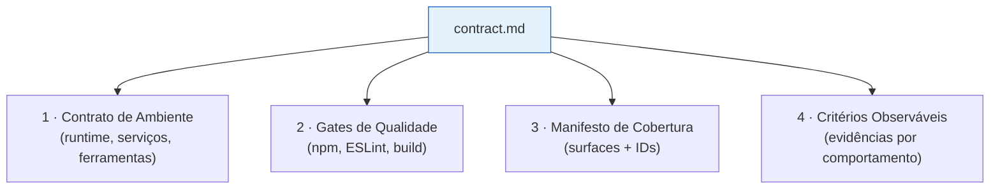

### Esboço de seções (template)

```markdown
# Contract — F01 Landing Page

## Environment Contract
- Dev runtime da aplicação web ativo, servindo a rota `/`
- Browser real via `Playwright CLI`
- (projetos complexos) mensageria / brokers / microserviços / DB

## Quality Gates
- [ ] Projeto roda (ex.: `npm run dev` / `npm start`)
- [ ] Lint sem erros (ex.: `ESLint`)
- [ ] Build do projeto conclui

## Coverage Manifest
- Surface: `Public-01` (UI · public access) → cobre a UI da Feature 01

## Surfaces & Behaviors
### Surface: UI — public access
- Estado inicial: visitante anônimo, sem cookies, sem sessão autenticada, acessando `/`
- Comportamentos:
  - [ ] rota carrega
  - [ ] produto é exposto
  - [ ] elementos visuais esperados presentes

## Observable Criteria
- [ ] CTA de registro presente
- [ ] Login na navegação superior
- [ ] Redirecionamento ligado à autenticação
- [ ] Aderência da identidade visual
```

---

## Impacto na skill `implement-feature`

No fluxo SDD (ver [Fluxo SDD e Implementação das Skills](./Fluxo_SDD_e_Implementacao_das_Skills.md)),
o `contract.md` é **gerado pelo `spec-writer`** (junto com `spec.md` + `plan.md`),
**satisfeito pelo `implement-feature`** (que cria os testes e cumpre os gates) e
**consumido pelo [`evaluator`](./Skill_Evaluator.md)** na avaliação.

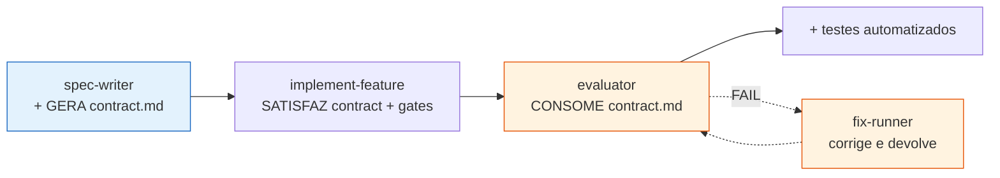

- O **`spec-writer`** passa a **gerar o `contract.md`** como terceiro artefato, ao lado de
  `spec.md` e `plan.md`.
- O **`implement-feature`** **satisfaz** o contrato: cria os testes e cumpre os gates nele
  declarados.
- O **`evaluator`** **consome** o `contract.md` para checar ambiente, gates e evidências —
  **junto com os testes automatizados**, não no lugar deles. Em FAIL, aciona o
  [`fix-runner`](./Skill_Fix_Runner.md). O estado da avaliação por feature
  (CLEAN/FAIL/PENDING/ABORTED) é registrado no `progress.json`.

---

## Checklist final — "meu `contract.md` está pronto?"

- [ ] Define o **contrato de ambiente** (runtime, serviços auxiliares, ferramentas) de forma que **um terceiro sem contexto** consiga conferir?
- [ ] Lista os **gates de qualidade** objetivos (execução, lint, build) como piso de aceitação?
- [ ] Traz um **manifesto de cobertura** mapeando comportamentos a surfaces com IDs (ex.: `Public-01`)?
- [ ] Organiza a cobertura por **surfaces**, cada uma com **estado inicial** e comportamentos concretos?
- [ ] Expressa cada aceitação como **critério observável** (evidência verificável), não como descrição vaga?
- [ ] Serve **tanto** ao agente implementador **quanto** à skill de validação — alinhando construção e aceitação?

> Quando todos os itens estiverem marcados, o `contract.md` deixa de ser um complemento e
> vira a **referência operacional** que une ambiente, qualidade e comportamento — fazendo a
> feature nascer já com seus critérios de execução e aceitação formalizados.
