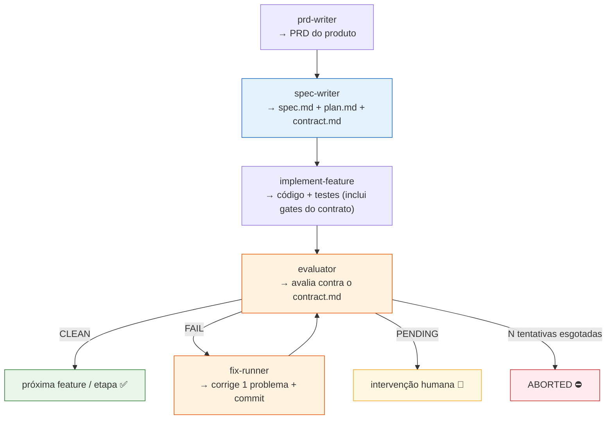
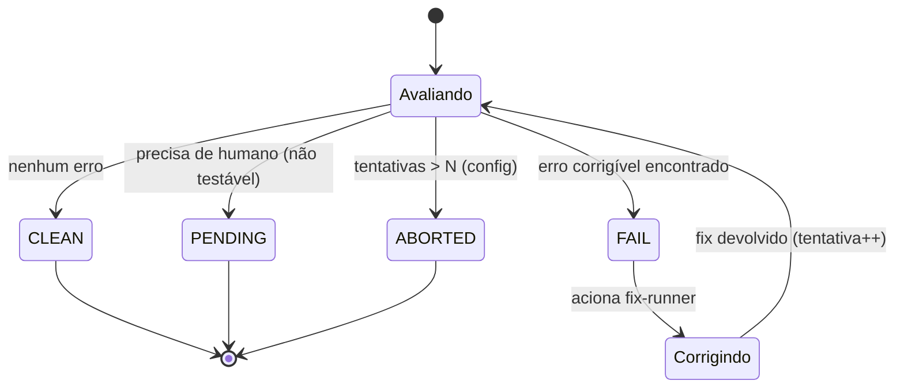
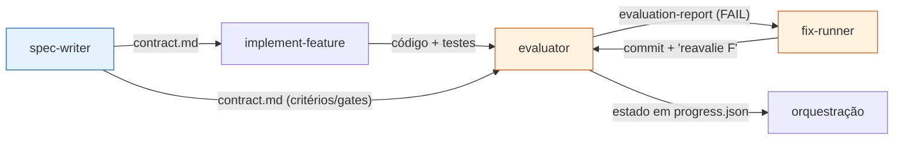
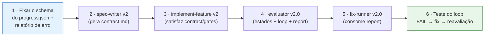

# Fluxo SDD e Guia de Implementação das Skills v2.0

> **Documento mestre.** Serve de base para o agente que vai **construir as novas skills**
> (versão 2.0), garantindo que ele não se perca — porque as skills **interagem e chamam umas
> às outras**. Aqui ficam: a sequência completa do fluxo, os contratos de handoff entre
> skills, a máquina de estados do `evaluator`, o schema de `progress.json`, e as regras de
> versionamento (v1 preservada, v2 nova).

**Documentos de base por skill:**
- [Requisitos para criar uma Skill](./requisitos_para_criar_skill.md)
- [Como criar Gates](./Como_criar_gates.md)
- [Contrato de Feature (`contract.md`)](./Contrato_de_Feature.md)
- [Skill `evaluator`](./Skill_Evaluator.md)
- [Skill `fix-runner`](./Skill_Fix_Runner.md)

---

## 1. Visão geral do fluxo (do produto à entrega)



**A sequência canônica:**

1. **`prd-writer`** gera o **PRD** do produto (features, dependências, critérios de aceitação).
2. **`spec-writer`** gera, por feature: **`spec.md`**, **`plan.md`** e o **`contract.md`**
   (que inclui os **gates**). *(Novo na v2: o `spec-writer` passa a emitir o `contract.md`.)*
3. **`implement-feature`** implementa a feature, **cria os testes** e satisfaz tudo que o
   `contract.md` exige, **incluindo os gates**.
4. **`evaluator`** avalia a feature implementada **contra o `contract.md`** e assume um
   **estado** (ver §3).
5. Em **FAIL**, o `evaluator` aciona o **`fix-runner`**, que corrige e devolve para nova
   avaliação. O loop repete até **CLEAN**, **PENDING** ou **ABORTED**.

---

## 2. Responsabilidades por skill (quem faz o quê)

| Skill | Entra | Produz | Chama | É chamada por |
|---|---|---|---|---|
| **`prd-writer`** | descrição do produto | `PRD.md` | — | usuário |
| **`spec-writer`** v2 | PRD + feature(s) | `spec.md`, `plan.md`, **`contract.md`** | — | usuário |
| **`implement-feature`** v2 | spec + plan + contract | código + testes + commits | — | usuário / orquestrador |
| **`evaluator`** | contract.md + progress.json + feature | relatório de avaliação + estado | **`fix-runner`** (em FAIL) | usuário / orquestrador |
| **`fix-runner`** | relatório de erro do evaluator | correção + commit | **`evaluator`** (reavaliação) | **`evaluator`** |

> 🔑 **Donos de responsabilidade que não podem se confundir:**
> - **Construir** = `implement-feature`. **Corrigir** = `fix-runner`. (separados de propósito)
> - **Orquestrar o loop de avaliação + contar tentativas + decidir estado** = `evaluator`.
> - **Gerar os critérios/gates** = `spec-writer` (no `contract.md`).

---

## 3. Máquina de estados do `evaluator`

O `evaluator` é o **dono do estado** da avaliação de cada feature. Os quatro estados:



| Estado | Significado | Ação |
|---|---|---|
| **CLEAN** | nenhum erro; conforme ao contrato | prossegue para a próxima etapa |
| **FAIL** | erro **corrigível** encontrado | grava relatório de erro → aciona `fix-runner` |
| **PENDING** | algo que o evaluator **não consegue testar** sozinho | pausa e pede intervenção humana |
| **ABORTED** | tentou corrigir **N vezes** sem sucesso | para o loop e reporta; **N vem da config do evaluator** |

**Regras do loop (donas do `evaluator`):**
- O **contador de tentativas** vive no `progress.json` e é incrementado pelo `evaluator` a
  cada ciclo FAIL → fix → reavaliação.
- O **limite N** é **configurável** (config do `evaluator`); ao exceder, estado vira
  **ABORTED**.
- O `fix-runner` **não** conhece N nem decide ABORTED — só aplica **uma** correção por
  invocação.

---

## 4. Contratos de handoff entre skills

A interação entre skills depende de **artefatos em disco** estáveis (não de memória de
sessão). Três handoffs importam:



### 4.1 `spec-writer` → `contract.md`
O `contract.md` é a **fonte única** de critérios de aceitação e gates. Estrutura em
[Contrato de Feature](./Contrato_de_Feature.md): contrato de ambiente, gates de qualidade,
manifesto de cobertura, critérios observáveis.

### 4.2 `evaluator` → `fix-runner` (relatório de erro)
Em FAIL, o `evaluator` **grava um relatório estruturado em disco** que o `fix-runner`
consome. Campos mínimos (ver [Skill Fix Runner](./Skill_Fix_Runner.md)):

```yaml
feature: F<ID>
attempt: <N>
status: FAIL
failures:
  - kind: gate | test | observable-criterion
    ref: <id do gate/critério no contract.md>
    message: <mensagem objetiva>
    location: <arquivo:linha | rota | comando>   # quando aplicável
    evidence: <log | caminho do screenshot>      # quando aplicável
```

### 4.3 `fix-runner` → `evaluator` (devolução)
O `fix-runner` commita a correção, registra a tentativa no `progress.json` e sinaliza
"reavalie F<ID>" (ou "não resolvido — motivo"). **Quem reconfirma é o `evaluator`.**

---

## 5. Schema do `progress.json` (estado compartilhado)

`progress.json` centraliza o **estado do fluxo por feature** e é lido/escrito pelo
`evaluator` (e atualizado pontualmente pelo `fix-runner`).

**Local dos artefatos (fixado):**
- `progress.json` → **raiz de `docs/`**.
- `contract.md` e `evaluation-report.json` → **`docs/<feature-id>-<kebab>/`** (junto de
  `spec.md` e `plan.md`).

```json
{
  "config": {
    "maxFixAttempts": 3
  },
  "features": {
    "F01": {
      "state": "PENDING_EVALUATION | CLEAN | FAIL | PENDING | ABORTED",
      "attempt": 0,
      "lastEvaluationReport": "docs/F01-<kebab>/evaluation-report.json",
      "updatedAt": "<ISO timestamp>"
    }
  }
}
```

> `state` inicial `PENDING_EVALUATION` é gravado pelo `implement-feature` ao concluir a
> feature (pronta para o `evaluator` rodar). Os demais estados (CLEAN/FAIL/PENDING/ABORTED)
> são do `evaluator` (§3).

| Campo | Dono | Significado |
|---|---|---|
| `config.maxFixAttempts` | `evaluator` | o **N** de tentativas antes de ABORTED |
| `features.<ID>.state` | `evaluator` | estado atual (§3) |
| `features.<ID>.attempt` | `evaluator` (incrementa) / `fix-runner` (registra) | nº da tentativa de correção |
| `features.<ID>.lastEvaluationReport` | `evaluator` | caminho do relatório que o `fix-runner` lê |

> ⚠️ A construção das skills deve **fixar e versionar este schema** antes de codar o loop —
> ele é o ponto de integração entre `evaluator` e `fix-runner`.

---

## 6. Pacote de skills

Este pacote reúne as skills do fluxo SDD com nomes finais (sem sufixos de versão):
`prd-writer`, `spec-writer`, `implement-feature`, `evaluator`, `fix-runner`, `gate-builder`,
`architecture-analyzer`, `deep-analyzer`.

- Cada skill é **autossuficiente**: caminhos entre elas são relativos dentro do pacote
  (`../<skill-irmã>/...`) e os documentos de base ficam em `docs/` (referenciados via
  `../../docs/...` a partir de cada `SKILL.md`).
- Para instalar, veja o `README.md` na raiz do pacote (cópia para `.claude/skills/` ou
  `npx skills add`).
- Cada skill referencia seu **documento de base** nesta pasta `docs/`.

---

## 7. Ordem de construção recomendada

Construir respeitando as dependências de handoff (quem produz o artefato vem antes de quem o
consome):



1. **Contratos primeiro:** fixar o schema do `progress.json` e do relatório de erro — eles
   amarram `evaluator` e `fix-runner`.
2. **`spec-writer` v2:** passa a gerar `contract.md` (com gates).
3. **`implement-feature` v2:** passa a satisfazer o `contract.md` e seus gates.
4. **`evaluator` v2.0:** estados, loop, contador, relatório de erro.
5. **`fix-runner` v2.0:** consome o relatório, corrige, devolve.
6. **Validar o loop completo** com uma feature real (FAIL forçado → fix → CLEAN).

---

## 8. Princípios invioláveis do fluxo (guard-rails para o construtor)

- 🧱 **Separação de papéis:** construir ≠ corrigir ≠ avaliar. Não fundir skills "por
  conveniência".
- 📑 **`contract.md` é a fonte única** de critérios/gates — o `evaluator` não inventa
  critérios fora dele.
- 🔁 **O `evaluator` é dono do loop e do estado** (contador, N, ABORTED). O `fix-runner` é
  stateless.
- 💾 **Handoffs por artefato em disco** (contract, evaluation-report, progress.json), não por
  memória de sessão — para sobreviver entre skills e execuções.
- ✂️ **`fix-runner` = menor footprint:** corrige só o erro reportado; nada de refatoração
  oportunista.
- 🧪 **Avaliação complementa testes**, não os substitui: o `evaluator` é a 2ª camada externa.
- 🗄️ **v1 preservada:** nunca editar a v1; a v2 nasce ao lado.

---

## Checklist final — "o construtor tem tudo para começar?"

- [ ] A **sequência** prd → spec → implement → evaluator (↔ fix-runner) está clara?
- [ ] As **responsabilidades** de cada skill (quem chama quem) estão delimitadas?
- [ ] A **máquina de estados** (CLEAN/FAIL/PENDING/ABORTED) e o dono do loop (`evaluator`) estão definidos?
- [ ] Os **contratos de handoff** (contract.md, evaluation-report, progress.json) estão especificados?
- [ ] O **schema do `progress.json`** (incluindo `maxFixAttempts`) está fixado antes de codar o loop?
- [ ] A regra de **versionamento** (v1 preservada, v2 nova) está acordada?
- [ ] A **ordem de construção** (contratos → spec-writer → implement → evaluator → fix-runner → teste do loop) está definida?

> Com este documento, o agente construtor tem o **mapa do fluxo e os contratos de
> integração** — pode construir cada skill v2 sabendo exatamente como ela conversa com as
> demais, sem se perder no encadeamento.
