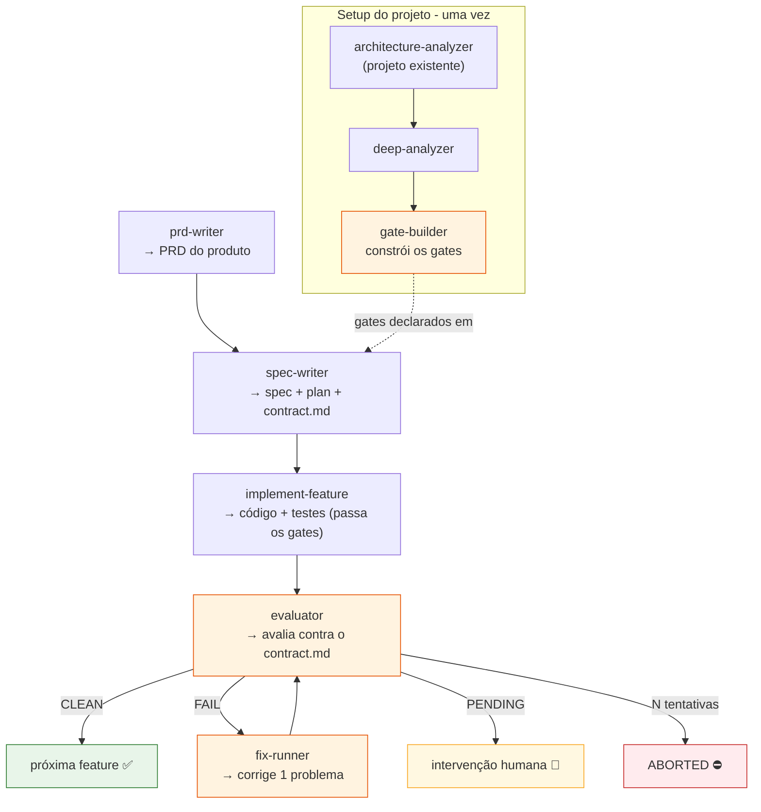
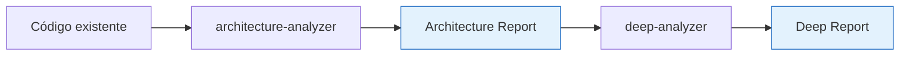
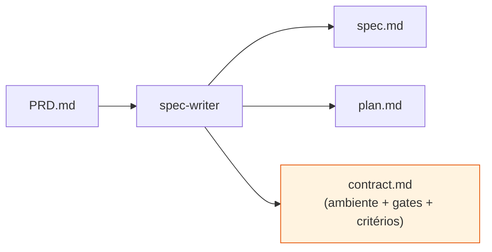
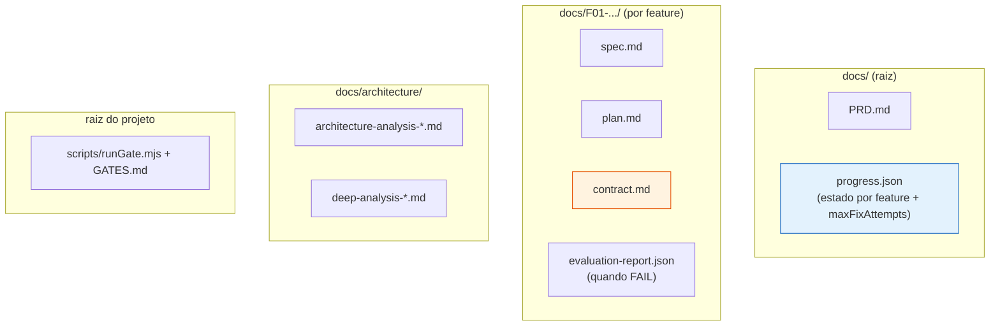

# Guia do Workflow SDD — Como usar as skills

> **Leia só este documento.** Ele reúne, de forma prática, **o que cada skill faz, quando
> chamá-la, o que entra e o que sai**, para você criar um projeto/feature do início ao fim
> **sem precisar abrir cada `SKILL.md`**. Para a teoria por trás de cada peça, há links para
> os documentos de base ao final.

---

## O fluxo em uma imagem



**Duas fases:**
1. **Setup do projeto (uma vez):** preparar a base — entender o código (se já existir) e
   **construir os gates** de qualidade.
2. **Ciclo por feature (repete para cada feature):** PRD → spec/contrato → implementação →
   avaliação (com correção automática quando falha).

---

## Tabela de referência rápida

| Skill | Quando usar | Entra | Sai | Chama |
|---|---|---|---|---|
| **architecture-analyzer** | Projeto **já existe** e você quer mapeá-lo | escopo/path do código | *Architecture Analysis Report* | — |
| **deep-analyzer** | Depois do architecture-analyzer | o Architecture Report + código | *Deep Analysis Report* | — |
| **gate-builder** | Antes de spec'ar features (setup) | Deep + Architecture Report | gates (configs/scripts) + `runGate` + `GATES.md` | — |
| **prd-writer** | Início de um produto novo | descrição do produto | `PRD.md` | — |
| **spec-writer** | Para cada feature, após o PRD | PRD + feature(s) | `spec.md` + `plan.md` + `contract.md` | — |
| **implement-feature** | Após a spec da feature | spec + plan + contract | código + testes + commits + `progress.json` | — |
| **evaluator** | Após implementar a feature | contract.md + progress.json + feature | report + estado + screenshots | **fix-runner** (código) / **test-writer** (teste) |
| **fix-runner** | **Só o evaluator chama** | `evaluation-report.json` (código) | correção de código + commit | **evaluator** (reavaliação) |
| **unit/integration/monorepo-unit-test-writer** | Escrita/correção de testes (PABX) | `target_file` (ou `evaluation-report.json` no fix) | testes escritos/corrigidos | — |
| **unit/integration/monorepo-unit-test-validator** | Auditar testes (PABX) | `test_file_path` | relatório de conformidade (PASS/FAIL) | — |

> 🔑 Você invoca diretamente as skills do fluxo, **exceto `fix-runner`** (só o evaluator chama).
> As **test-writers/validators** você pode chamar direto (modo interativo, com aprovação) **ou**
> elas são chamadas automaticamente pelo `implement-feature` (escrita) e pelo `evaluator`
> (correção de teste, modo autônomo).
> ⚠️ As 6 skills de teste assumem a estrutura do **monorepo PABX** (`apps/frontend`, `apps/backend`,
> `apps/*`) — ver a nota de escopo no fim.

---

## FASE 1 — Setup do projeto (uma vez)

### Passo 1A — Projeto JÁ existe (brownfield): mapear o código

Se você está adotando o fluxo num projeto que já tem código, primeiro entenda o que existe.

**1. `architecture-analyzer`** — inventário de superfície (stack, entry points, módulos,
dependências, integrações, anti-patterns, cobertura de testes).
- **Quando:** uma vez, no começo, para projeto existente.
- **Saída:** *Architecture Analysis Report* em `docs/architecture/`.

**2. `deep-analyzer`** — análise profunda item a item (lifecycle de cada endpoint, contratos,
modelos de dados, falhas, lacunas de teste).
- **Quando:** logo após o architecture-analyzer (ele **exige** o relatório anterior).
- **Saída:** *Deep Analysis Report* em `docs/architecture/`.



> **Projeto novo (greenfield)?** Você pode pular 1A — não há código para analisar ainda. O
> `gate-builder` (passo 1B) funciona mesmo sem os relatórios, construindo a stack de gates a
> partir das convenções do seu stack.

### Passo 1B — Construir os gates: `gate-builder`

Os **gates** são as verificações automáticas pass/fail (typecheck, lint zero-warnings, build,
testes, regras de arquitetura, código morto) que protegem o projeto. Eles precisam **existir
antes** de implementar features.

- **Quando:** uma vez, no setup, **antes** de spec'ar a primeira feature.
- **Entra:** Deep + Architecture Report (ou, em greenfield, as convenções do stack).
- **Como funciona (2 fases):**
  1. **Plano:** a skill detecta greenfield vs. brownfield e **mostra um plano** dos gates
     (comandos, configs, ordem do `runGate`). **Espera seu "yes".**
  2. **Construção:** escreve os configs/scripts, cria o orquestrador `runGate` e **verifica
     que cada gate roda**.
- **Sai:** infraestrutura de gates + `scripts/runGate.mjs` + `GATES.md`.
- **Brownfield:** ativa zero-warnings **incrementalmente** (com baseline), sem quebrar o build.

> 💡 **Importante:** o `gate-builder` **constrói** os gates. Depois, o `spec-writer` apenas
> **declara** esses gates (por `id`) no `contract.md` de cada feature. São coisas diferentes:
> infraestrutura (uma vez) vs. declaração (por feature).

---

## FASE 2 — Ciclo por feature (repete para cada feature)

### Passo 2A — Definir o produto: `prd-writer`

- **Quando:** uma vez por **produto** (não por feature). Gera o documento-mãe com todas as
  features, dependências e critérios de aceitação.
- **Entra:** descrição do produto (o que é, para quem, principais funcionalidades).
- **Como funciona:** entrevista você, depois gera um PRD de 9 seções (features com IDs
  `F01, F02...`, grafo de dependências, ondas de execução, critérios de aceitação).
- **Sai:** `PRD.md` (tipicamente em `docs/`).

> Já tem um PRD? Pule este passo. O PRD é a **fonte de verdade** para todas as skills
> seguintes.

### Passo 2B — Especificar a feature: `spec-writer`

- **Quando:** para **cada feature** que você vai implementar, após o PRD.
- **Entra:** o PRD + a referência da feature (`F01`, nome, ou uma onda inteira em batch).
- **Como funciona:** lê a feature no PRD, explora o código para captar padrões, entrevista
  você sobre o que o PRD/código não respondem, e gera **três** artefatos.
- **Sai (em `docs/<id>-<kebab>/`):**
  - `spec.md` — especificação técnica (arquitetura, contratos, modelo de dados, testes)
  - `plan.md` — plano de implementação em fases
  - **`contract.md`** — o contrato operacional: **ambiente** necessário, **gates de
    qualidade** (declarados por `id`, vindos do `gate-builder`), **manifesto de cobertura** e
    **critérios observáveis**
- **Modo batch:** passe vários IDs ou uma onda (`wave 2`) e ele gera várias features em
  paralelo, auto-aceitando as recomendações.



### Passo 2C — Implementar a feature: `implement-feature`

- **Quando:** após a spec da feature existir (precisa dos **três** arquivos, incluindo o
  `contract.md`).
- **Entra:** a referência da feature (`F01`, pasta, etc.) + o PRD (auto-descoberto).
- **Como funciona:** implementa **fase a fase** (do `plan.md`), **delega a escrita dos testes**
  à test-writer correta (por caminho/stack, em modo autônomo) — ou escreve os testes ele mesmo
  se o projeto não for PABX (fallback genérico) —, valida cada fase rodando os **gates do
  contrato**, e **commita 1 commit por fase**. Ao final, faz uma verificação completa (suíte
  cheia + gates + critérios de aceitação).
- **Sai:** código + testes + commits + atualização do `progress.json` marcando a feature como
  **`PENDING_EVALUATION`** (pronta para o evaluator).
- **Não usa** `git add -A`, não cria/troca branch, não pula hooks.

> Se faltar o `contract.md`, ele aborta e te manda gerar a spec com `spec-writer` — sinal
> de que a feature foi spec'ada com a v1 antiga.

### Passo 2D — Avaliar a feature: `evaluator`

Aqui entra a **segunda camada** de validação — um olhar externo, independente da
autoverificação do implementador.

- **Quando:** depois de implementar a feature.
- **Entra:** a feature (ID, explícito) + o `contract.md` + o `progress.json` (auto-descobertos).
- **Como funciona:** verifica o **contrato de ambiente** (se não atende, vira PENDING e nem
  avalia), roda os **gates**, exercita as **surfaces** e confere os **critérios observáveis**
  (com screenshots quando é UI).
- **Decide um estado:**

| Estado | Significado | O que acontece |
|---|---|---|
| **CLEAN** | sem erros, conforme o contrato | ✅ feature pronta — siga para a próxima |
| **FAIL** | erro corrigível | aciona o `fix-runner` automaticamente (ver 2E) |
| **PENDING** | algo que ele não consegue testar sozinho | 🙋 pede intervenção humana |
| **ABORTED** | tentou corrigir N vezes sem sucesso | ⛔ para e reporta |

- **Sai:** report (✓/✗/— por critério) + screenshots + estado gravado no `progress.json`.
- **Ele é o dono do loop:** mantém o contador de tentativas (`maxFixAttempts`, default 3) e
  decide quando vira ABORTED.

### Passo 2E — Correção automática: roteada por tipo de falha (você não chama)

Quando o `evaluator` acha uma falha, ele **classifica e roteia**:

- **Falha de código** (`kind: gate` / `observable-criterion`) → **`fix-runner`**: correção
  mínima no código, commit `fix(F<ID>)`, devolve ao evaluator. (Comportamento original.)
- **Falha de teste** (`kind: test`) → **test-writer correspondente** (escolhida pelo
  caminho/stack do teste) corrige **só o teste** → **test-validator correspondente** confirma
  conformidade (PASS) → só então o evaluator **retoma a avaliação de onde parou**.

**A suíte é escolhida pelo caminho do teste** (regra determinística):
`apps/frontend/*.spec.ts` ou `apps/backend/__tests__/unit/*.test.js` → **unit**;
`apps/backend/__tests__/integration/` → **integration**; demais `apps/` → **monorepo**.

O **loop e o contador N são sempre do evaluator** — o sub-loop de teste
(writer→validator) consome o mesmo orçamento de tentativas.

```mermaid
sequenceDiagram
    participant Você
    participant Ev as evaluator
    participant Fr as fix-runner
    participant Tw as test-writer
    participant Tv as test-validator

    Você->>Ev: avalie F01
    Ev->>Ev: roda gates + critérios; classifica falhas
    alt CLEAN
        Ev-->>Você: ✅ pronto
    else FAIL código (attempt < N)
        Ev->>Fr: corrija (kind: gate/observable)
        Fr-->>Ev: correção + commit → reavalie
        Note over Ev: attempt++ e repete
    else FAIL teste (attempt < N)
        Ev->>Tw: corrija o teste (kind: test, autônomo)
        Tw-->>Ev: teste corrigido
        Ev->>Tv: valide o teste corrigido
        Tv-->>Ev: PASS
        Note over Ev: attempt++ e retoma a avaliação
    else attempt >= N
        Ev-->>Você: ⛔ ABORTED
    else não testável
        Ev-->>Você: 🙋 PENDING
    end
```

---

## Receitas prontas

### Projeto novo (greenfield), do zero

```text
1. prd-writer                  → PRD.md
2. gate-builder                → constrói os gates (greenfield, da stack)
3. spec-writer  F01         → spec + plan + contract
4. implement-feature  F01   → código + testes + commits
5. evaluator  F01              → CLEAN? segue. FAIL? ele corrige sozinho (fix-runner)
6. repita 3→5 para F02, F03…
```
> Em greenfield você pode rodar o `gate-builder` logo após a primeira feature de fundação, se
> preferir ter código mínimo para os gates verificarem. Mas tê-los cedo evita acúmulo de
> dívida.

### Projeto existente (brownfield), adotando o fluxo

```text
1. architecture-analyzer       → Architecture Report
2. deep-analyzer               → Deep Report
3. gate-builder                → adapta e constrói os gates (zero-warnings incremental)
4. prd-writer                  → PRD.md (se ainda não existir)
5. spec-writer  F01         → spec + plan + contract
6. implement-feature  F01   → código + testes
7. evaluator  F01              → avalia (com correção automática)
8. repita 5→7 por feature
```

### Várias features de uma onda em paralelo

```text
spec-writer  wave 2         → gera spec+plan+contract de todas as features da onda 2
                                 (auto-aceitando recomendações; features de fundação rodam
                                  em sequência, as demais em paralelo)
```

---

## Artefatos do fluxo (onde mora cada coisa)



- **`progress.json`** (raiz de `docs/`): o "placar" do fluxo — estado de cada feature
  (`PENDING_EVALUATION` → `CLEAN`/`FAIL`/`PENDING`/`ABORTED`) e o limite de tentativas.
- **`contract.md`** (por feature): a **fonte única** dos critérios de aceitação e gates — o
  ponto de encontro entre quem implementa e quem avalia.
- **`evaluation-report.json`** (por feature, em FAIL): o handoff do evaluator para o
  fix-runner.

---

## Quem chama quem (mapa de invocação)

| Skill | Você invoca? | Chama outra skill? |
|---|---|---|
| architecture-analyzer | ✅ sim | não |
| deep-analyzer | ✅ sim | não |
| gate-builder | ✅ sim | não |
| prd-writer | ✅ sim | não |
| spec-writer | ✅ sim (single ou batch) | não |
| implement-feature | ✅ sim | ✅ chama uma **test-writer** (escrita, autônomo) |
| evaluator | ✅ sim | ✅ **fix-runner** (código) / **test-writer**→**test-validator** (teste) |
| **fix-runner** | ❌ **não** — só o evaluator | ✅ devolve ao **evaluator** |
| test-writer (unit/integration/monorepo) | ✅ sim (interativo) ou via skill (autônomo) | não |
| test-validator (unit/integration/monorepo) | ✅ sim ou via evaluator | não |

---

## Regras de ouro do fluxo (para não se perder)

- 🧱 **Papéis separados:** **construir** (`implement-feature`) ≠ **corrigir**
  (`fix-runner`) ≠ **avaliar** (`evaluator`) ≠ **construir gates** (`gate-builder`). Nunca
  misture.
- 📑 **O `contract.md` é a fonte única** de critérios/gates. O evaluator não inventa critérios
  fora dele.
- 🔁 **O `evaluator` é o dono do loop** (contador, N tentativas, ABORTED). Ele **roteia** por
  tipo: código → `fix-runner`; teste → test-writer→test-validator. Corretores são stateless.
- 🧪 **Código ≠ teste:** `fix-runner` conserta código; as **test-writers** consertam testes;
  as **test-validators** confirmam. Nunca mande teste ao fix-runner nem código à test-writer.
- 💾 **Tudo passa por arquivos em disco** (PRD, contract, progress.json, evaluation-report) —
  o estado sobrevive entre skills e execuções.
- 🛠️ **Gates antes das features:** rode o `gate-builder` no setup; o `spec-writer` só
  **declara** o que já existe.

---

## Escopo das skills de teste (PABX)

As 6 skills de teste (`unit`/`integration`/`monorepo-unit`-`test-writer`/`validator`) foram
extraídas de prompts maduros do **monorepo PABX** e assumem sua estrutura:

- **unit-test-*** → `apps/frontend/` (Angular, `.spec.ts`) e `apps/backend/__tests__/unit/` (Node, `.test.js`).
- **integration-test-*** → `apps/backend/__tests__/integration/` (Jest + supertest, DB de teste real).
- **monorepo-unit-test-*** → demais `apps/` (node-express / node-worker / python-fastapi).

As **regras hiper-específicas** (mock de jQuery/localStorage, padrão `Promise.all()`,
`setupTestDatabase`/ordem de FK, mock de GPU/torch, `NODE_ENV=testing`) vivem em
`references/pabx-rules.md` de cada skill. **Cada skill tem dois modos:** interativo (3 fases +
aprovação) quando você chama direto; autônomo (sem pausa) quando `implement-feature`/`evaluator`
as chamam.

> **Projeto não-PABX?** O `implement-feature` detecta e usa o **fallback genérico** (escreve os
> testes ele mesmo); as skills de teste são específicas do PABX. Para adaptar a outro monorepo,
> ajuste os `pabx-rules.md`.

---

## Documentos de base (a teoria por trás)

- [requisitos_para_criar_skill.md](./requisitos_para_criar_skill.md) — como uma skill é construída
- [Como_criar_gates.md](./Como_criar_gates.md) — o que são gates determinísticos e como montá-los
- [Contrato_de_Feature.md](./Contrato_de_Feature.md) — estrutura e papel do `contract.md`
- [Skill_Evaluator.md](./Skill_Evaluator.md) — rationale do avaliador, estados e loop
- [Skill_Fix_Runner.md](./Skill_Fix_Runner.md) — rationale do corretor especializado
- [Fluxo_SDD_e_Implementacao_das_Skills.md](./Fluxo_SDD_e_Implementacao_das_Skills.md) — o documento mestre (handoffs, schemas, versionamento)

> Este guia é o **mapa operacional**. Os documentos acima são o **manual de referência**.
> Para usar o fluxo no dia a dia, este guia basta.
