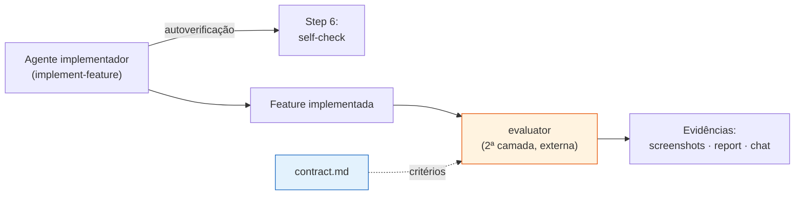
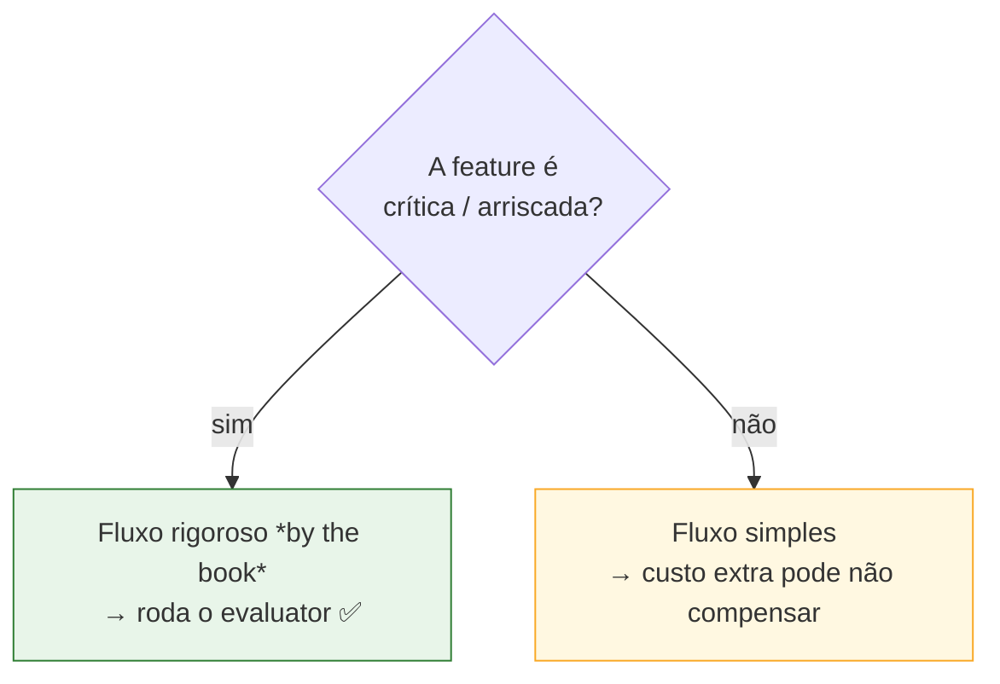
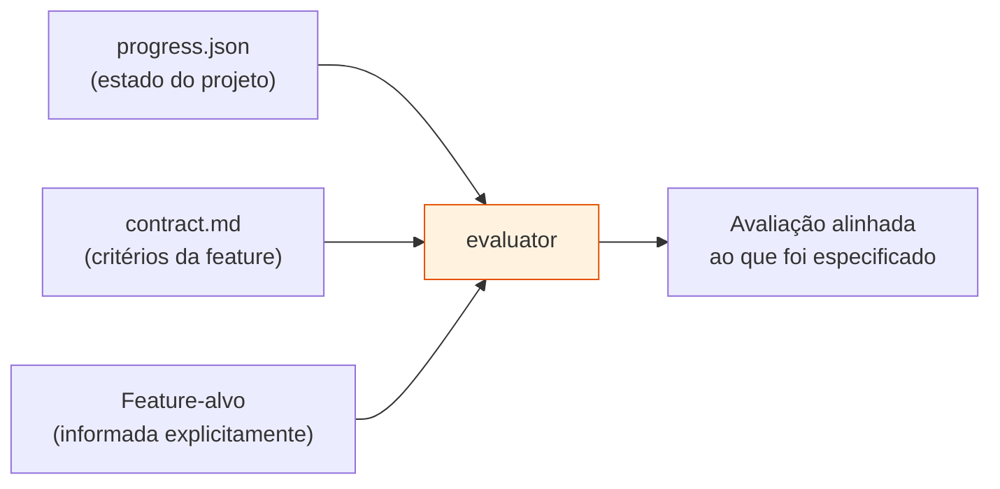
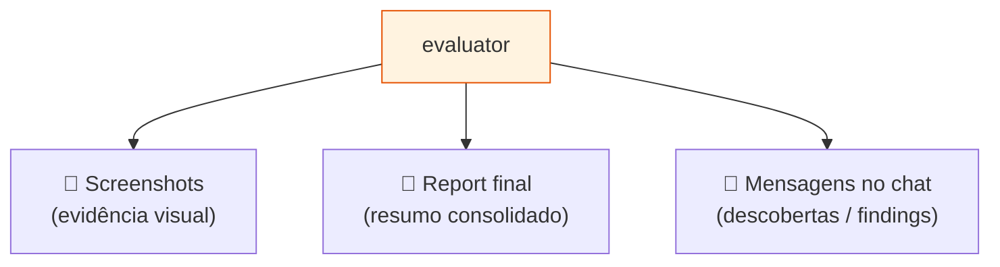
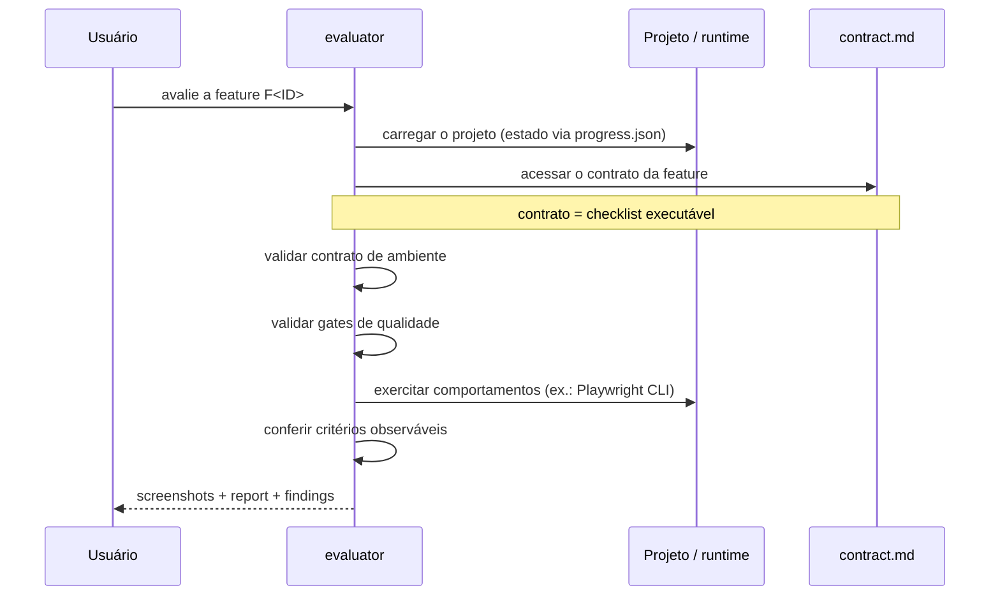
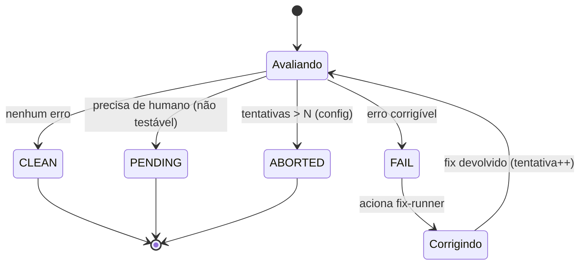
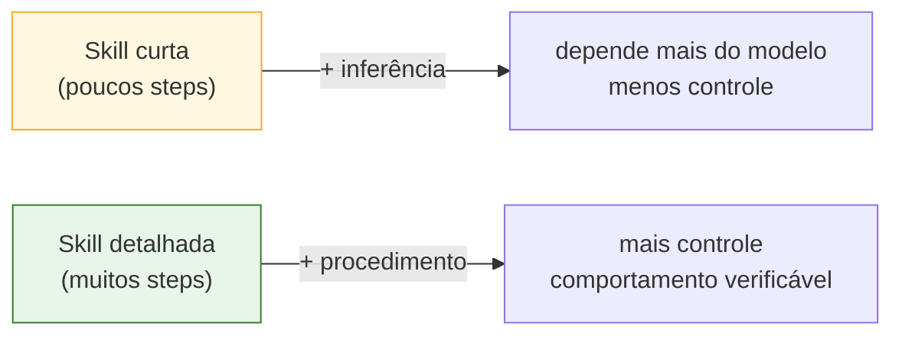
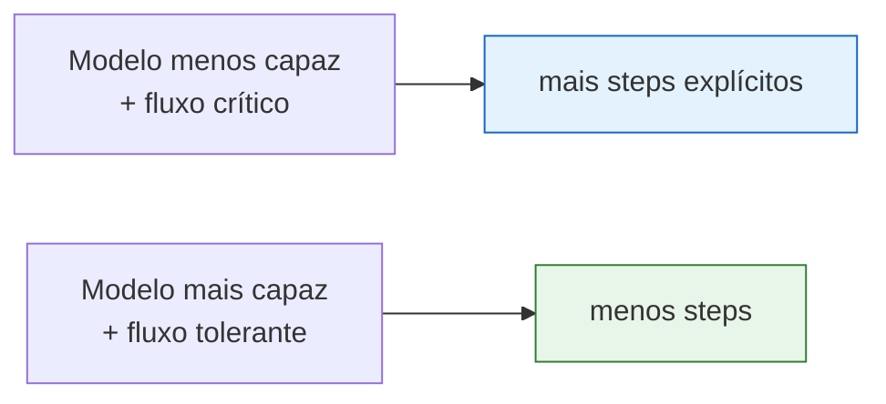
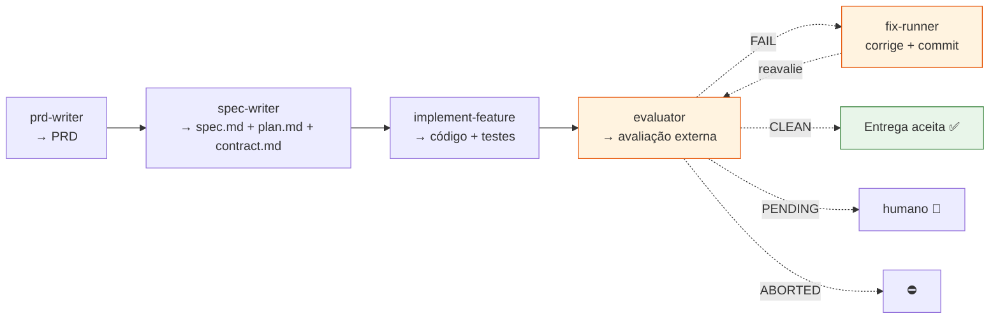

# A Skill `evaluator` (Avaliador de Feature)

> **Documento de base para construção da skill.** Este material reúne o que é necessário
> para criar a skill `evaluator` — um avaliador externo que verifica uma feature já
> implementada **contra o [`contract.md`](./Contrato_de_Feature.md)**, agindo como segunda
> camada de validação ao lado dos testes automatizados. Ele **orquestra o loop de avaliação**
> (mantém o contador de tentativas, decide os estados e aciona o
> [`fix-runner`](./Skill_Fix_Runner.md) em caso de falha). Segue o nível de detalhamento das
> skills atuais, especialmente [spec-writer](../skills/spec-writer/SKILL.md) (steps
> numerados, modos, regras Always/Never, edge cases). Panorama do fluxo em
> [Fluxo SDD e Implementação das Skills](./Fluxo_SDD_e_Implementacao_das_Skills.md).

---

## A ideia central em uma frase

> O `evaluator` é um **agente separado** que olha a feature **de fora** e confirma, contra o
> contrato, se a entrega está conforme — encontrando desvios que a autoverificação do
> implementador deixou passar.



**Por que uma segunda camada?** Quem implementou tende a enxergar a própria entrega com viés
de confirmação. Um agente externo, orientado **só** pelo contrato, traz uma **visão de fora**
sobre a conformidade — o ganho principal da avaliação externa.

---

## 1. Avaliação externa: o papel do `evaluator`

O `evaluator` **não substitui** a autoverificação do `implement-feature` (Step 6 daquela
skill) nem os testes automatizados. Ele **adiciona** uma camada independente.

| Camada | Quem faz | Foco |
|---|---|---|
| Autoverificação | o próprio `implement-feature` | "eu fiz o que pedi?" |
| Testes automatizados | suíte do projeto | comportamento codificado |
| **`evaluator` (externo)** | **agente separado** | **conformidade ao contrato, com olhar de fora** |

> 🔑 O `contract.md` continua sendo **a referência dos critérios de aceitação**. A novidade
> é separar **quem implementa** de **quem avalia**.

---

## 2. Trade-off: qualidade vs. custo (quando usar)

Adicionar um `evaluator` **aumenta o custo operacional** — é mais uma execução consumindo
tokens. Isso torna a avaliação externa uma **decisão de engenharia**, não um passo
obrigatório universal.



- **Fluxos rigorosos:** aplicar o processo completo reduz risco e aumenta a confiança na
  entrega.
- **Fluxos simples:** o custo adicional pode não compensar.

> 💡 Implicação de design: a skill deve **assumir invocação sob demanda** (o usuário decide
> quando rodar), não ser disparada automaticamente a cada feature.

---

## 3. Entradas da avaliação

A skill `evaluator` usa o **estado do projeto** e os **artefatos já produzidos**. Ela não
parte do zero nem avalia "a página" genericamente — a avaliação é **orientada por contexto,
escopo e critérios observáveis**.



| Entrada | Para quê serve |
|---|---|
| **`progress.json`** | descobrir o estado atual do projeto / o que já foi feito |
| **`contract.md` da feature** | os critérios de aceitação observáveis e os gates |
| **ID/nome da feature-alvo** | dado **explicitamente**, define o escopo da avaliação |

> O resultado é uma checagem alinhada **ao que foi especificado**, não apenas **ao que parece
> funcionar**.

---

## 4. Saídas produzidas pelo `evaluator`

A avaliação pode retornar evidências em **formatos diferentes**, conforme a necessidade do
fluxo — combinando evidência visual, resumo consolidado e feedback textual.



| Saída | Utilidade prática |
|---|---|
| **Screenshots** | prova visual de critérios de UI (CTA presente, layout, etc.) |
| **Report final** | visão consolidada para aprovação/correção |
| **Mensagens no chat** | findings textuais imediatos para o usuário |

> A combinação facilita **tanto a inspeção humana quanto a decisão automatizada** sobre
> aprovar ou mandar corrigir.

---

## 5. Sequência de verificação orientada por contrato

O `evaluator` segue uma **sequência operacional** previsível. Como o contrato já foi
definido antes, ele funciona aqui como **checklist executável** para a análise.



**Fluxo essencial:** carregar o projeto → acessar o contrato → executar as verificações →
confirmar se está tudo ok.

> A qualidade da avaliação depende **menos de opinião subjetiva** e **mais da aderência aos
> critérios já estabelecidos** no contrato — o que reduz ambiguidade e torna a validação
> **previsível**.

### Mapeamento contrato → verificação

Reaproveitando os quatro blocos do [`contract.md`](./Contrato_de_Feature.md):

| Bloco do contrato | O que o `evaluator` faz |
|---|---|
| **Contrato de ambiente** | confere runtime/serviços; se não atende, **aborta antes de avaliar** |
| **Gates de qualidade** | roda lint/build/execução; falhou → reprova no piso técnico |
| **Manifesto de cobertura** | percorre cada surface declarada, sem deixar lacuna |
| **Critérios observáveis** | coleta evidência (ex.: screenshot) de cada sinal esperado |

---

## 6. Estados do `evaluator` e o loop de correção

O `evaluator` é o **dono do estado** da avaliação de cada feature e **orquestra o loop** de
correção. Ele assume um de **quatro estados**:



| Estado | Significado | Ação |
|---|---|---|
| **CLEAN** | nenhum erro; conforme ao contrato | prossegue para a próxima etapa |
| **FAIL** | erro **corrigível** encontrado | grava relatório de erro → aciona o `fix-runner` |
| **PENDING** | algo que o `evaluator` **não consegue testar** sozinho | pausa e pede intervenção humana |
| **ABORTED** | tentou corrigir **N vezes** sem sucesso | para o loop e reporta |

### O loop FAIL → fix → reavaliação

```mermaid
sequenceDiagram
    participant Ev as evaluator
    participant Pr as progress.json
    participant Fx as fix-runner

    Ev->>Pr: lê maxFixAttempts (N) e attempt atual
    Ev->>Ev: avalia contra o contract.md
    alt CLEAN
        Ev->>Pr: state = CLEAN
    else FAIL e attempt < N
        Ev->>Pr: state = FAIL; grava evaluation-report
        Ev->>Fx: corrija (passa o relatório de erro)
        Fx-->>Ev: correção aplicada (commit) — reavalie
        Ev->>Pr: attempt++
        Note over Ev: re-executa a avaliação
    else FAIL e attempt >= N
        Ev->>Pr: state = ABORTED
    else não testável
        Ev->>Pr: state = PENDING
    end
```

> 🔑 **O `evaluator` é dono do contador e do limite N.** O
> [`fix-runner`](./Skill_Fix_Runner.md) é **stateless**: aplica **uma** correção por
> invocação e devolve. Quem incrementa `attempt`, compara com `N` e decide **ABORTED** é o
> `evaluator`.

### Estado compartilhado: `progress.json`

A configuração de **N tentativas** (`maxFixAttempts`) e o **estado por feature** vivem no
`progress.json` (schema completo em
[Fluxo SDD e Implementação das Skills](./Fluxo_SDD_e_Implementacao_das_Skills.md)):

```json
{
  "config": { "maxFixAttempts": 3 },
  "features": {
    "F01": {
      "state": "CLEAN | FAIL | PENDING | ABORTED",
      "attempt": 0,
      "lastEvaluationReport": "docs/F01-.../evaluation-report.json"
    }
  }
}
```

### Handoff de erro para o `fix-runner`

Em FAIL, o `evaluator` **grava um relatório estruturado em disco** (não passa o erro só por
chat). O `fix-runner` consome esse artefato. Campos mínimos:

```yaml
feature: F<ID>
attempt: <N>
status: FAIL
failures:
  - kind: gate | test | observable-criterion
    ref: <id do gate/critério no contract.md>
    message: <mensagem objetiva>
    location: <arquivo:linha | rota | comando>   # quando aplicável
    evidence: <log | caminho do screenshot>      # quando aplicável
```

---

## 7. Granularidade da skill e nível de restrição (decisão de design)

Quanto **detalhar** a skill é uma escolha **controversa** e depende do contexto de avaliação.



- **Skill curta:** basta em casos simples; maior dependência de inferência do modelo.
- **Skill detalhada:** muitos steps explícitos **restringem** o comportamento e garantem um
  procedimento **verificável** — útil em fluxos críticos.

> ⚖️ Trade-off: quanto **mais detalhado** o passo a passo, **maior o controle**; quanto **mais
> enxuta** a skill, **maior a dependência de inferência**. Para o `evaluator`, que decide
> aprovação/correção, **pender para o detalhado** costuma valer a pena.

### Evolução dos modelos e redução de instruções

À medida que os modelos ficam mais capazes, **parte dos passos explícitos pode ser removida**
sem perder qualidade — o agente infere melhor a intenção operacional a partir de menos
instruções.



> ⚠️ **Cuidado:** reduzir steps **cedo demais** enfraquece a consistência da avaliação,
> sobretudo em fluxos críticos. O ponto de equilíbrio é **ajustar o detalhamento ao risco e à
> maturidade do modelo** — não cortar por economia.

---

## Esboço da skill `evaluator` (no padrão das skills atuais)

A seguir, um **rascunho de estrutura** alinhado ao formato de
[spec-writer](../skills/spec-writer/SKILL.md) e
[implement-feature](../skills/implement-feature/SKILL.md). É ponto de partida para a
redação final.

### Frontmatter e INPUT/OUTPUT

```markdown
---
name: evaluator
description: Avalia externamente uma feature já implementada contra seu contract.md,
  produzindo screenshots, um report final e findings no chat. Camada de validação
  independente da autoverificação do implementador e complementar aos testes automatizados.
---

## INPUT
- ID/nome da feature-alvo (explícito e obrigatório)
- Auto-descobre: progress.json (estado do projeto) e o contract.md da feature
- Instruções livres no fim (overrides) — ex.: "sem screenshots", "só os gates"

## OUTPUT
- Screenshots (evidência visual dos critérios observáveis)
- Report final consolidado (✓ / ✗ / — por critério do contrato)
- Findings no chat
- Estado da feature gravado no progress.json (CLEAN | FAIL | PENDING | ABORTED)
- Em FAIL: relatório de erro estruturado em disco (consumido pelo fix-runner)
- Nenhum arquivo de código é alterado pelo próprio evaluator — ele AVALIA e ORQUESTRA o
  loop; quem corrige é o fix-runner
```

### Steps sugeridos

```markdown
### Step 1 — Resolver entrada
- Resolver a feature-alvo (ID/nome). Abortar se ausente/ambígua, listando candidatas.
- Localizar progress.json e o contract.md da feature. Sem contract.md → abortar
  ("gere o contrato primeiro").

### Step 2 — Carregar contexto
- Ler progress.json (estado) e contract.md (ambiente, gates, cobertura, critérios).
- Carregar a feature como escopo da avaliação.

### Step 3 — Verificar contrato de ambiente
- Conferir runtime/serviços exigidos. Se o ambiente não atende → abortar a avaliação
  (ambiente inválido ≠ implementação errada). Logar como "ambiente não satisfeito".

### Step 4 — Rodar gates de qualidade
- Executar os gates declarados (lint, build, execução). Falha → reprova no piso técnico.

### Step 5 — Validar surfaces e critérios observáveis
- Para cada surface do manifesto de cobertura, partir do estado inicial e exercitar os
  comportamentos (ex.: navegar a rota via Playwright CLI). Coletar evidência por critério.

### Step 6 — Produzir saídas
- Gerar screenshots, montar o report final (✓/✗/— por critério) e emitir findings no chat.

### Step 7 — Decisão de estado
- Determinar o estado: CLEAN (sem erros) | FAIL (erro corrigível) | PENDING (não testável,
  precisa de humano) | ABORTED (tentativas > N).
- Derivar da aderência ao contrato — nunca de "pareceu ok". Listar quais critérios falharam.

### Step 8 — Loop de correção (quando FAIL)
- Ler maxFixAttempts (N) e attempt do progress.json.
- Se attempt >= N → state = ABORTED; parar e reportar.
- Senão: gravar o relatório de erro estruturado, marcar state = FAIL, acionar o fix-runner
  passando o relatório, incrementar attempt e RE-AVALIAR (voltar ao Step 3).
- O evaluator é o dono do contador e do limite N; o fix-runner é stateless.

### Step 9 — Persistir estado
- Gravar o estado final da feature no progress.json (CLEAN | PENDING | ABORTED) e o caminho
  do último relatório de avaliação.
```

### Regras Always / Never (rascunho)

```markdown
**Always:**
- Tratar o contract.md como fonte única dos critérios de aceitação.
- Abortar a avaliação se o contrato de ambiente não for satisfeito (e dizer que é ambiente).
- Derivar o estado da aderência ao contrato, com evidência por critério.
- Ser dono do loop: manter attempt/N no progress.json e decidir CLEAN/FAIL/PENDING/ABORTED.
- Em FAIL, gravar o relatório de erro em disco e acionar o fix-runner; reavaliar após a
  correção até CLEAN, PENDING ou ABORTED.

**Never:**
- Alterar código de produção ou "consertar" a feature (corrigir é papel do fix-runner).
- Aprovar com base em percepção visual sem checar os gates objetivos.
- Avaliar uma feature sem contract.md.
- Inferir critérios que não estão no contrato.
- Exceder N tentativas sem marcar ABORTED.
```

---

## Onde o `evaluator` se encaixa no fluxo SDD



O `evaluator` **fecha o ciclo**: consome o `contract.md` (gerado pelo `spec-writer`),
avalia a implementação e, em FAIL, aciona o [`fix-runner`](./Skill_Fix_Runner.md) — repetindo
até CLEAN, PENDING ou ABORTED. Opcional por custo, recomendado em fluxos críticos.

---

## Checklist final — "minha skill `evaluator` está pronta?"

- [ ] É um **agente separado**, independente da autoverificação do implementador?
- [ ] Consome **`contract.md`** como fonte única dos critérios de aceitação?
- [ ] Recebe a **feature-alvo explicitamente** e lê o **`progress.json`** para o estado do projeto?
- [ ] **Aborta** quando o **contrato de ambiente** não é satisfeito (sem confundir com erro de implementação)?
- [ ] Roda os **gates de qualidade** antes da inspeção funcional?
- [ ] Percorre **surfaces** e coleta **evidência por critério observável**?
- [ ] Produz **screenshots + report final + findings no chat**?
- [ ] Decide o **estado** (CLEAN/FAIL/PENDING/ABORTED) derivado da aderência ao contrato — nunca de "pareceu ok"?
- [ ] É **dono do loop**: mantém `attempt`/`maxFixAttempts` no `progress.json` e, em FAIL, grava o relatório de erro e aciona o **`fix-runner`**, reavaliando até CLEAN/PENDING/ABORTED?
- [ ] **Não corrige código** — apenas avalia e orquestra (corrigir é do `fix-runner`; complementa testes, não os substitui)?
- [ ] Teve o **nível de detalhamento ajustado ao risco do fluxo e à maturidade do modelo**?

> Quando todos os itens estiverem marcados, o `evaluator` deixa de ser uma "segunda opinião"
> informal e passa a ser uma **camada de validação externa, determinística e orientada por
> contrato** — fechando o fluxo SDD com confiança proporcional ao risco da feature.
