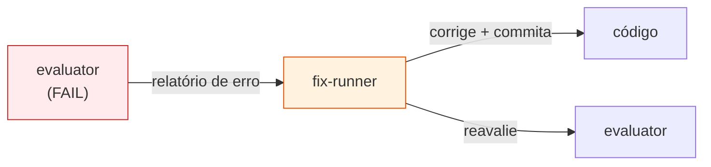
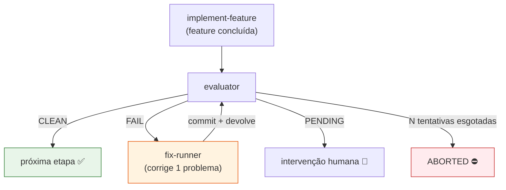
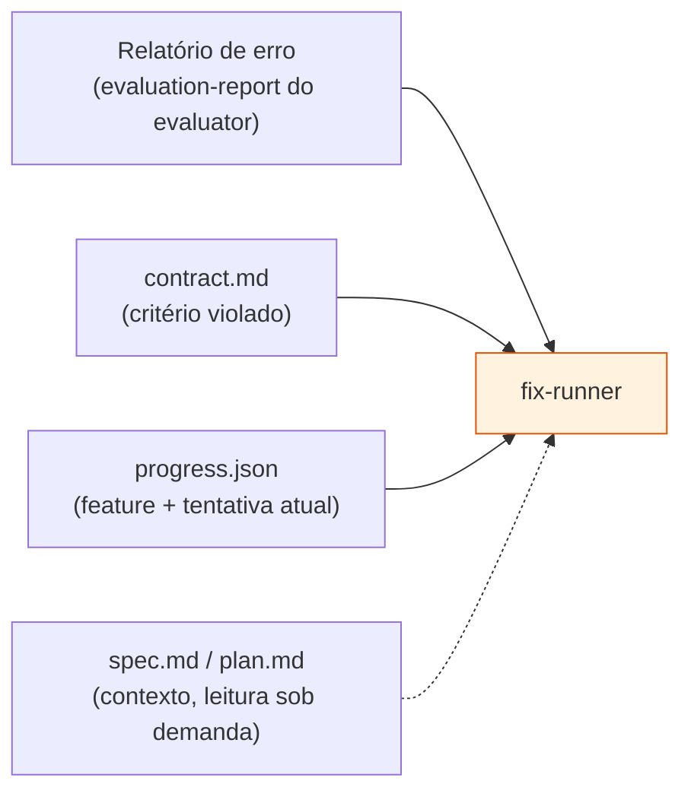
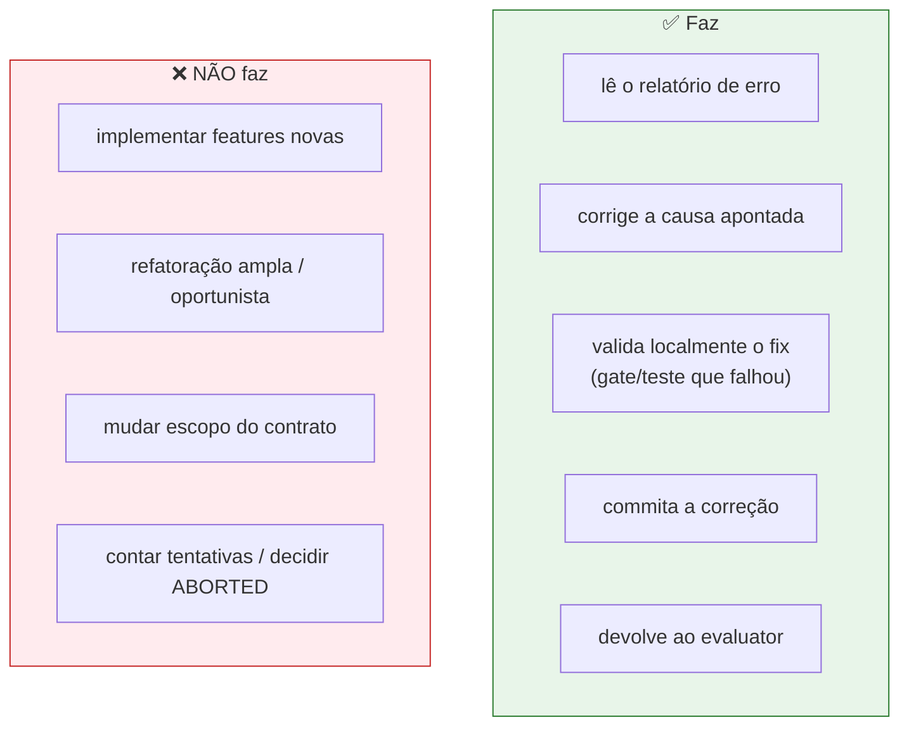
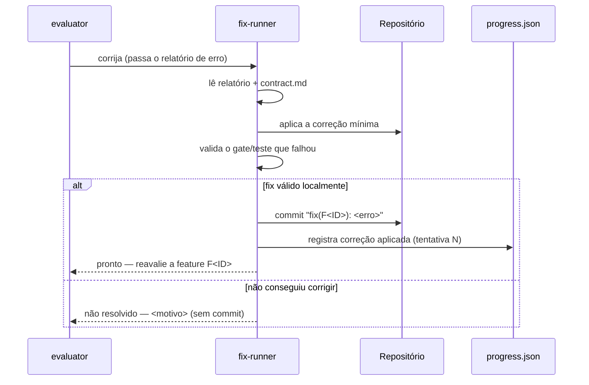
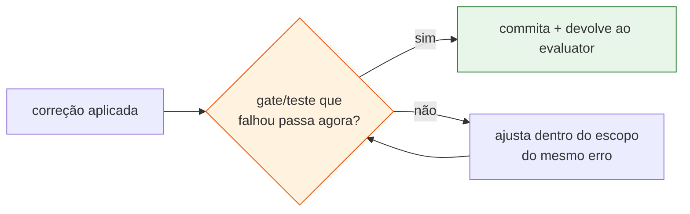
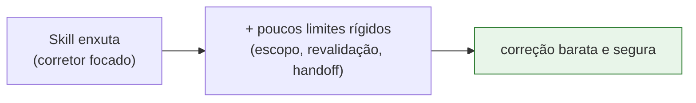

# A Skill `fix-runner` (Corretor Especializado)

> **Documento de base para construção da skill.** Reúne os pré-requisitos da skill
> `fix-runner` — um corretor **leve e especializado** acionado pelo
> [`evaluator`](./Skill_Evaluator.md) quando uma avaliação retorna **FAIL**. Ele corrige
> **apenas** o problema apontado, commita a correção e **devolve o controle ao `evaluator`**
> para reconfirmação. Segue o nível de detalhamento das skills atuais
> ([spec-writer](../skills/spec-writer/SKILL.md),
> [implement-feature](../skills/implement-feature/SKILL.md)).

---

## A ideia central em uma frase

> O `fix-runner` **não constrói features** — ele **conserta** o desvio que o `evaluator`
> encontrou, com o menor footprint possível, e pede ao `evaluator` que reconfirme.



**Por que uma skill separada do `implement-feature`?** Quando o `evaluator` roda, o
`implement-feature` já considera seu trabalho **concluído**. Reabrir a skill pesada de
construção para um conserto pontual é caro e amplo demais. O `fix-runner` é **menor, mais
leve e mais focado**: menos instruções, escopo restrito, custo menor por iteração.

| | `implement-feature` | `fix-runner` |
|---|---|---|
| Foco | construir a feature do zero (fases) | corrigir **um** problema apontado |
| Entrada | spec.md + plan.md + PRD | relatório de erro do `evaluator` |
| Escopo | amplo (toda a feature) | mínimo (só o necessário p/ o fix) |
| Tamanho | skill grande | skill enxuta |
| Quem chama | usuário / orquestrador | **`evaluator`** (em FAIL) |

---

## 1. Posição no fluxo SDD

O `fix-runner` é o elo de correção do ciclo de avaliação. **Quem orquestra o loop é o
[`evaluator`](./Skill_Evaluator.md)** — ele mantém o contador de tentativas e decide os
estados. O `fix-runner` é **stateless**: entra, corrige, commita, sai.



> 🔑 O `fix-runner` **não decide** quando parar nem conta tentativas — isso é
> responsabilidade do `evaluator` (via `progress.json`). O `fix-runner` faz **uma**
> correção por invocação.

---

## 2. Entradas da correção

O `fix-runner` é orientado pelo **relatório de erro estruturado** que o `evaluator` gravou em
disco (ver [Contrato de Feature](./Contrato_de_Feature.md) e
[Skill Evaluator](./Skill_Evaluator.md)). Ele **não** re-avalia nem re-descobre o problema —
parte do diagnóstico pronto.



| Entrada | Para quê serve |
|---|---|
| **Relatório de erro** (artefato em disco) | o diagnóstico: qual critério/gate falhou, mensagem, arquivo/linha, evidência |
| **`contract.md`** | reler o critério violado para corrigir **em conformidade**, não "à toa" |
| **`progress.json`** | identificar a feature-alvo e o número da tentativa atual |
| **`spec.md` / `plan.md`** | contexto da feature — lido **sob demanda**, não em varredura ampla |

> 💡 O relatório de erro é o **contrato de handoff** entre `evaluator` e `fix-runner`. Sua
> estrutura precisa ser estável (ver seção *Contrato de handoff* abaixo).

---

## 3. O que o `fix-runner` faz (e o que NÃO faz)



**Princípio do menor footprint:** o `fix-runner` toca **apenas** o necessário para resolver o
erro reportado. Nada de "já que estou aqui, melhoro isto também" — isso é trabalho do
`implement-feature` ou de uma refatoração dedicada.

---

## 4. Saídas e handoff de volta ao `evaluator`



**Saídas:**

- 🔧 **Correção no código** (escopo mínimo).
- 📝 **1 commit por correção** — ex.: `fix(F<ID>): <resumo do erro>` — coerente com o estilo
  do `implement-feature`. Stage apenas dos arquivos tocados (sem `git add -A`/`.`).
- 🔁 **Devolução ao `evaluator`** pedindo reavaliação da feature.
- 🪵 Atualização leve no `progress.json` registrando que a tentativa N aplicou correção
  (o `evaluator` é quem incrementa/decide o estado).

> O `fix-runner` **não** emite veredicto CLEAN/FAIL — quem reconfirma é o `evaluator`. Ele só
> sinaliza "apliquei a correção" ou "não consegui corrigir".

---

## 5. Validação local antes de devolver

Antes de devolver ao `evaluator`, o `fix-runner` faz uma **verificação local barata**:
rodar especificamente o **gate ou teste que falhou** no relatório, para não devolver um fix
obviamente quebrado.



> ⚠️ Essa validação local **não substitui** o `evaluator`. É só um "smoke check" para evitar
> devolver lixo. A confirmação **oficial** (contra todo o contrato) continua sendo do
> `evaluator` — que pode encontrar um efeito colateral que o fix introduziu.

---

## 6. Granularidade da skill (decisão de design)

Por ser **especializada**, a skill tende ao **enxuto**: poucos steps, escopo bem delimitado.
Ainda assim, como participa de um loop automatizado em fluxos potencialmente críticos, alguns
**limites invioláveis** devem ser explícitos (não tocar fora do escopo, sempre revalidar o
gate que falhou, sempre devolver ao `evaluator`).



> O equilíbrio: **enxuta no procedimento**, **rígida nos limites** — para um corretor que roda
> sozinho dentro de um loop, os guard-rails importam mais que o passo a passo extenso.

---

## Esboço da skill `fix-runner` (no padrão das skills atuais)

### Frontmatter e INPUT/OUTPUT

```markdown
---
name: fix-runner
description: Corretor especializado acionado pelo evaluator em FAIL. Lê o relatório de erro
  estruturado, aplica a correção mínima para o problema apontado, valida o gate/teste que
  falhou, commita (1 commit/correção) e devolve a feature ao evaluator para reconfirmação.
  Não implementa features novas nem orquestra o loop de tentativas.
---

## INPUT
- Feature-alvo (ID) + caminho do relatório de erro gravado pelo evaluator
- Auto-descobre: contract.md da feature e progress.json (tentativa atual)
- Lê spec.md/plan.md sob demanda apenas para contexto do fix

## OUTPUT
- Correção mínima no código + 1 commit ("fix(F<ID>): <erro>")
- Atualização leve no progress.json (correção aplicada na tentativa N)
- Devolução ao evaluator pedindo reavaliação
- NÃO emite veredicto; NÃO conta tentativas; NÃO decide ABORTED
```

### Steps sugeridos

```markdown
### Step 1 — Resolver entrada
- Resolver feature-alvo e localizar o relatório de erro do evaluator. Sem relatório → abortar
  ("fix-runner requer um relatório de erro do evaluator").

### Step 2 — Carregar contexto mínimo
- Ler o relatório de erro (critério/gate violado, mensagem, arquivo/linha, evidência).
- Reler do contract.md apenas o critério violado. Ler spec.md/plan.md sob demanda.
- Ler progress.json para saber a feature e a tentativa atual.

### Step 3 — Aplicar correção mínima
- Corrigir EXCLUSIVAMENTE a causa apontada. Nenhuma refatoração oportunista.
- Registrar o que foi alterado e por quê (para o commit e o handoff).

### Step 4 — Validar localmente
- Rodar especificamente o gate/teste que falhou. Se ainda falha, ajustar dentro do mesmo
  escopo de erro. Não expandir o escopo para "outros problemas".

### Step 5 — Commitar
- 1 commit, stage só dos arquivos tocados, mensagem "fix(F<ID>): <erro>" (ou estilo do repo).
  Sem git add -A/.; sem pular hooks.

### Step 6 — Devolver ao evaluator
- Atualizar o progress.json (correção aplicada, tentativa N).
- Sinalizar ao evaluator: "correção aplicada — reavalie F<ID>" OU "não resolvido — <motivo>".
```

### Contrato de handoff (relatório de erro ↔ fix-runner)

Campos mínimos que o relatório do `evaluator` deve conter para o `fix-runner` agir:

```markdown
- feature: F<ID>
- attempt: <N>            # tentativa atual (gerida pelo evaluator)
- status: FAIL
- failures:
  - kind: gate | test | observable-criterion
    ref:  <id do gate/critério no contract.md>
    message: <mensagem objetiva>
    location: <arquivo:linha | rota | comando> (quando aplicável)
    evidence: <log | caminho de screenshot> (quando aplicável)
```

### Regras Always / Never (rascunho)

```markdown
**Always:**
- Agir apenas a partir de um relatório de erro do evaluator.
- Corrigir somente a causa apontada (menor footprint possível).
- Revalidar localmente o gate/teste que falhou antes de devolver.
- Commitar 1 correção por invocação, staging só dos arquivos tocados.
- Devolver o controle ao evaluator para reconfirmação.

**Never:**
- Implementar features novas ou ampliar escopo do contrato.
- Fazer refatoração oportunista fora do erro reportado.
- Contar tentativas, decidir ABORTED ou emitir veredicto CLEAN/FAIL (papel do evaluator).
- Usar git add -A / git add . ; pular hooks ; criar/trocar de branch.
```

---

## Checklist final — "minha skill `fix-runner` está pronta?"

- [ ] É **acionada pelo `evaluator`** a partir de um **relatório de erro estruturado**?
- [ ] Corrige **apenas** a causa apontada, com **menor footprint** (sem refatoração oportunista)?
- [ ] **Revalida localmente** o gate/teste que falhou antes de devolver?
- [ ] Commita **1 correção por invocação**, staging só dos arquivos tocados?
- [ ] Atualiza o **`progress.json`** registrando a correção da tentativa N (sem decidir o estado)?
- [ ] **Devolve o controle ao `evaluator`** para reconfirmação, sem emitir veredicto próprio?
- [ ] **Não** conta tentativas nem decide **ABORTED** (papel do `evaluator`)?
- [ ] É **enxuta no procedimento** e **rígida nos limites** (escopo, revalidação, handoff)?

> Quando todos os itens estiverem marcados, o `fix-runner` é um **corretor cirúrgico**: barato,
> focado e seguro dentro do loop do `evaluator` — fechando o ciclo FAIL → fix → reavaliação
> sem reabrir a skill pesada de implementação.
