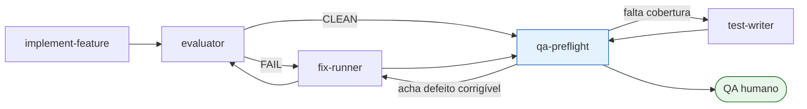

# A Skill `qa-preflight` (Portão antes do QA)

> **Documento de design.** Registra as decisões que a skill codifica, por que cada uma foi
> tomada e o que ela deliberadamente **não** faz. O `SKILL.md` é a instrução operacional;
> este documento é o porquê.

---

## A ideia central em uma frase

> A `qa-preflight` **não escreve um plano de testes**. Ela investiga a feature pronta,
> **corrige o que é objetivamente corrigível**, deixa uma **guarda permanente** para o
> defeito não voltar, e entrega ao QA humano **apenas o que exige julgamento** — com o
> resultado do que a máquina já verificou anexado, para ele revisar em vez de repetir.

A diferença entre "gerar plano" e "portão": um gerador de plano transfere trabalho para o
humano. Um portão **reduz** o trabalho do humano e usa o que sobra como definição do que
realmente precisa de gente.

---

## 1. Posição no fluxo SDD

**Standalone por decisão.** A `qa-preflight` **não é invocada** por `spec-writer`,
`implement-feature` nem `evaluator`. Ela roda **quando a feature está pronta**, por chamada
humana explícita. Motivo: ela é o último olhar antes de um humano gastar horas na tela, e
esse olhar só faz sentido sobre o produto terminado — rodá-la a cada fase produziria ruído
sobre código em movimento.

**Ela não corrige nada por conta própria.** Despacha os corretores que já existem, com a
disciplina que eles já têm (correção mínima, revalidação local, um commit por correção).

---

## 2. As quatro fases

| Fase | O que faz | Sai |
|---|---|---|
| **1. Investigação** | Pré-flight de ambiente; lê spec/plan/contract/PRD, rotas, permissões e o diff; abre a tela e **executa** o que é automatizável | Inventário + achados classificados |
| **2. Checkpoint** | Apresenta o inventário **e a lista de correções propostas**, separadas em "vou corrigir" e "vai para o QA" | Aprovação humana |
| **3. Correção** | Despacha `fix-runner`/test-writer para o que foi aprovado; re-executa o que corrigiu | Commits |
| **4. Entrega** | Escreve os artefatos e roda a **auto-revisão** que os reprova se algum critério ficou sem caso, algum caso tem mais de um resultado esperado, algum caso depende do anterior, ou algum resultado esperado exige julgamento | 2 arquivos + 1 CSV |

**O checkpoint é obrigatório e não pode ser pulado.** É a única coisa entre uma skill útil
e uma skill que altera código já validado sem ninguém olhando. Mesmo correção mecânica
passa por ele.

**A fase 3 vem antes da 4 de propósito:** o plano precisa descrever o produto corrigido,
não o produto com o defeito. Corrigir depois de escrever o plano invalidaria o plano.

---

## 3. Pré-flight de ambiente (lição cara)

Antes de qualquer coisa, a fase 1 verifica o ambiente e **falha com mensagem clara** se
algo faltar. Isso não é zelo: numa primeira execução real da suíte visual do PABX, a
ausência de um pacote e uma corrida no login produziram **13 timeouts de 60s** que não
diziam nada sobre o produto.

| Verificação | Por que |
|---|---|
| App responde na URL base | Sem isso, todo caso morre em timeout |
| Backend responde | Idem, com sintoma diferente |
| Runner de browser instalado | `@playwright/test` pode estar **declarado e não instalado** |
| Login automatizado funciona | Ver abaixo |
| Dados existem no tenant da conta usada | Sem dado não há o que medir |

**Sobre o login:** em ambientes com proteção anti-bot no login, a skill **não** tenta
contornar a proteção. Ela verifica se o ambiente **de desenvolvimento** oferece a saída
oficial (uma variável que desliga a verificação fora de produção) e, se não oferecer,
**para e reporta** — em vez de gastar a sessão inteira em timeout. No PABX essa saída
existe e está documentada no `SKILL.md`.

> **Nunca** semear sessão, forjar token ou burlar proteção de produção. Se o ambiente não
> permite login automatizado, isso é um achado a reportar, não um obstáculo a contornar.

---

## 4. A regra que decide corrigir × escalar

A fronteira é conservadora e explícita. **Na dúvida, escala.**

### Corrige (mecânico, verificável, sem julgamento)

- Violação de regra determinística que um gate já codifica
- Contraste abaixo do piso **quando existe token correto**, medido antes e depois
- Texto de UI factualmente errado contra o comportamento implementado
- Chave de mensagem inexistente caindo em fallback
- Cobertura ausente para regra que **já existe** no código → despacha o test-writer

### Escala sempre (precisa de humano)

- **Divergência entre spec e comportamento** — qual dos dois está errado é decisão de produto
- Regra de negócio ambígua ou não escrita
- Mudança de contrato de API, schema ou migration
- Arquivo fora da feature — legado de terceiros, outra linha de trabalho
- Estética, densidade, hierarquia — julgamento visual
- Tudo que a skill não conseguiu executar (hardware, telefonia, credencial, segundo tenant)

### A regra de ouro do "não medido"

**"Não havia o que medir" é resultado inconclusivo, nunca aprovado.** Um caso que a skill
não conseguiu exercitar vai para o QA marcado como tal. Isso vale para tela sem dado,
elemento que não apareceu e asserção que não chegou a rodar.

Origem da regra: numa suíte visual real, três asserções se auto-pulavam quando não achavam
o que medir. A suíte reportava verde. A asserção de contraste — a razão nº 1 da suíte
existir — **nunca havia executado uma única vez**. Quando passou a executar, achou um badge
a 4.15:1 num piso de 4.5.

---

## 5. Reuso: a skill não sabe corrigir

A `qa-preflight` produz um relatório no **mesmo schema** que o `evaluator` já usa
(`evaluation-report.json`) e despacha:

- **`fix-runner`** → `kind: gate`, `observable-criterion`, `qa-finding`
- **test-writer da vez** (`unit`/`integration`/`monorepo`) → `kind: test`

### Duas emendas necessárias nas skills existentes

1. **`fix-runner`** hoje exige um relatório "produzido pelo evaluator" e aborta sem ele.
   Passa a aceitar também um relatório da `qa-preflight`.
2. **O schema ganha `kind: qa-finding`** — para o defeito que **nenhum critério do contrato
   cobria**. Nesse caso o `ref` é o **ID do caso de QA** que encontrou, o que preserva
   rastreabilidade sem inventar critério retroativo.

O `qa-finding` existe porque o defeito mais caro é justamente o que nenhum contrato previa:
um contraste insuficiente não viola critério nenhum e passa por todos os gates verdes.

---

## 6. Os artefatos

### 6.1 O plano — `docs/qa/QA-<FEATURE>.md` + `.csv`

**Colunas** (as 7 que o QA já usa, na mesma ordem de leitura, com três inserções):

| Coluna | Preenchida por | Valores |
|---|---|---|
| ID | skill | `CT-<AREA>-<NNN>` com a área por **nome completo**: `CT-AGENTES-001`, `CT-DATAS-004`. Os quatro eixos têm áreas reservadas — `CT-ACESSIBILIDADE-*`, `CT-PERMISSOES-*`, `CT-FALHA-*`, `CT-FRONTEIRA-*` — para não competirem com os blocos funcionais |
| **Prioridade** | skill | Crítica · Alta · Média · Baixa (por risco) |
| Funcionalidade | skill | bloco funcional |
| Cenário | skill | ação imperativa + o dado a usar |
| Resultado Esperado | skill | **um** resultado verificável sem julgamento |
| Resultado Obtido | **skill quando executou**, senão QA | o que foi observado |
| Status | **QA** | Passou · Falhou · Bloqueado · Não executado |
| **Severidade** | QA | Crítica · Alta · Média · Baixa · Cosmética |
| **Verificado por** | skill | gate · teste automatizado · browser · ninguém |
| Observações | QA | motivo obrigatório quando Bloqueado |

**Status fica em branco mesmo quando a skill executou.** O veredito é do QA; um status
pré-julgado convida a homologar no automático. O `Resultado Obtido` preenchido é o que
permite **revisar** em vez de repetir.

**Separação Status × Severidade.** Vocabulário anterior de um time real misturava resultado
de execução com severidade de achado. O mapeamento:

| Antes | Agora |
|---|---|
| Aprovado | Status = Passou |
| Reprovado | Status = Falhou (+ Severidade) |
| Invalidável | Status = **Bloqueado**, motivo obrigatório |
| Pode melhorar | Status = Passou + **Severidade Baixa/Cosmética** |

Severidade é técnica (o quanto quebra) e é do QA. **Prioridade de correção é decisão de
produto e não entra na planilha** — misturar as duas é o erro clássico.

**O `.md`** traz, antes da matriz: escopo e não-escopo; pré-requisitos (URL, perfil,
permissão, dados); vocabulário da feature; a ordem de execução por risco; e **"limites
conhecidos — não reportar como defeito"**. O **`.csv`** é a mesma matriz, importável direto
como database.

### 6.2 Os achados — `docs/qa/ACHADOS-<FEATURE>.md`

O que foi encontrado, o que foi **corrigido** (com o commit), o que foi **escalado** e por
quê. Cada achado carrega a **guarda permanente proposta**: a asserção pronta para a suíte
visual, ou a regra nova de gate, ou o teste que faltava.

**A skill escreve a asserção dentro da suíte visual apenas quando o gate visual já estiver
ligado.** Com o gate desligado, ela entrega a asserção pronta no relatório e para por aí —
escrever numa suíte não provada é empilhar dívida sobre dívida.

---

## 7. Derivação: de onde saem os casos

Cada eixo tem sua técnica. É isso que produz granularidade sem inventar caso.

| Eixo | Técnica | Exemplo do que gera |
|---|---|---|
| **Funcional** | Transição de estado + tabela de decisão | selecionar um / vários / nenhum / agir sem seleção |
| **Fronteira** | Partição de equivalência + valor-limite | vazio, mínimo−1, máximo+1, formato inválido, datas invertidas |
| **Permissões** | Matriz perfil × ação | o que fica desabilitado, **com o motivo no tooltip** |
| **Falha e vazio** | Por carga: sucesso, vazio legítimo, erro, 409/422 | erro **não** pode se apresentar como "nada encontrado" |
| **Acessibilidade** | Escuro→claro, contraste composto, teclado, foco | badge, botão **e o `:hover`** |

**Contraste se mede compondo o fundo translúcido sobre o pai.** Uma medição contra
superfície sólida mente: um token criado justamente para corrigir contraste foi medido em
4.53:1 no papel e rendeu **4.15:1** na tela, porque o elemento real tinha tinta translúcida
por cima da linha.

**Filtro só está testado com valor que retorna resultado.** Resultado vazio não distingue
filtro que funciona de filtro ignorado.

---

## 8. Granularidade da skill (decisão de design)

A `qa-preflight` **não** vira um par writer/validator como as skills de teste. A
auto-revisão da fase 4 cobre o mesmo terreno (rastreabilidade, atomicidade, independência,
resultado verificável) e um par novo seria mais superfície para manter. Se a qualidade do
plano se mostrar irregular na prática, o validator vira uma skill à parte — não antes.

---

## Checklist final — "minha skill `qa-preflight` está pronta?"

- [ ] O `SKILL.md` cabe em algumas centenas de linhas e os detalhes longos estão em `references/`?
- [ ] O checkpoint é **obrigatório** e nenhuma correção acontece antes dele?
- [ ] A regra corrigir × escalar está explícita, com "na dúvida, escala"?
- [ ] "Não medido" é sempre inconclusivo, nunca verde?
- [ ] O pré-flight de ambiente falha com mensagem clara em vez de timeout?
- [ ] A skill despacha corretores existentes em vez de corrigir sozinha?
- [ ] Os dois artefatos + CSV têm formato fixo e exemplo?
- [ ] As emendas ao `fix-runner` e ao schema foram aplicadas no mesmo PR?
