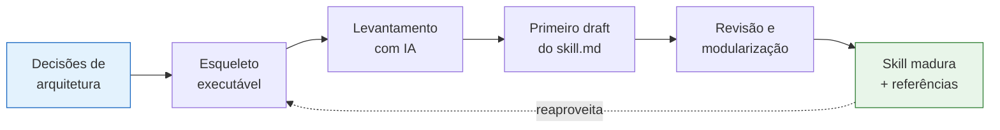
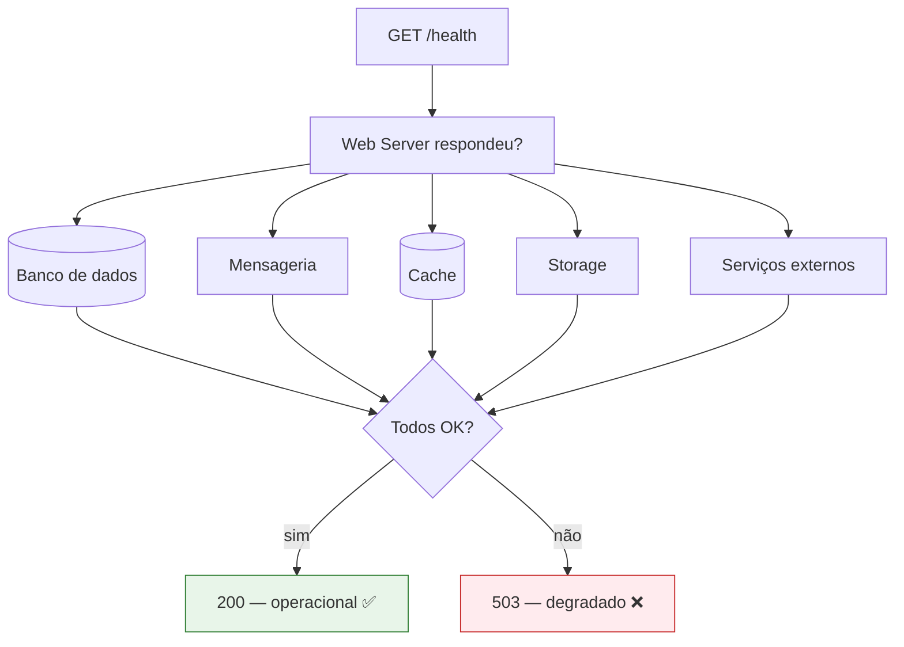
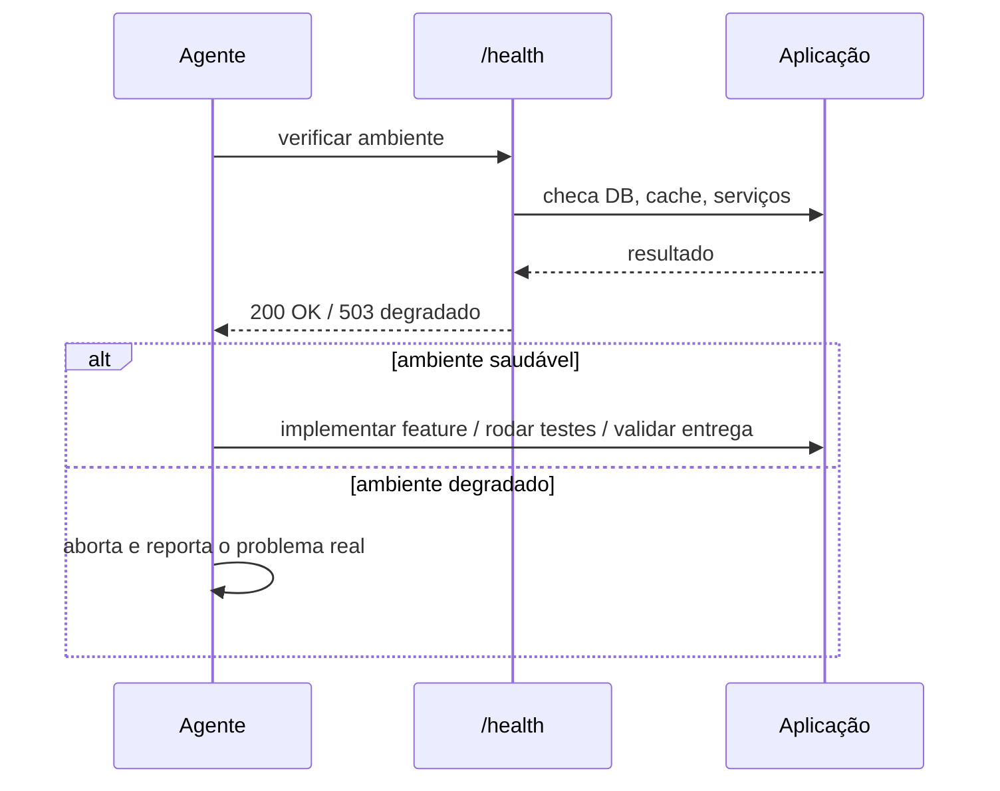
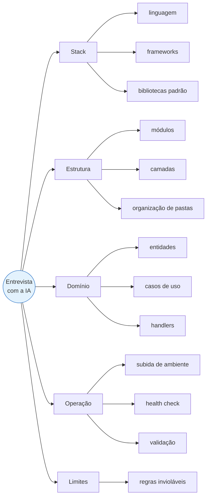
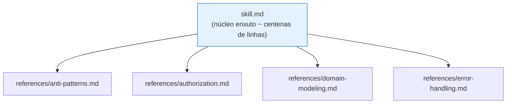
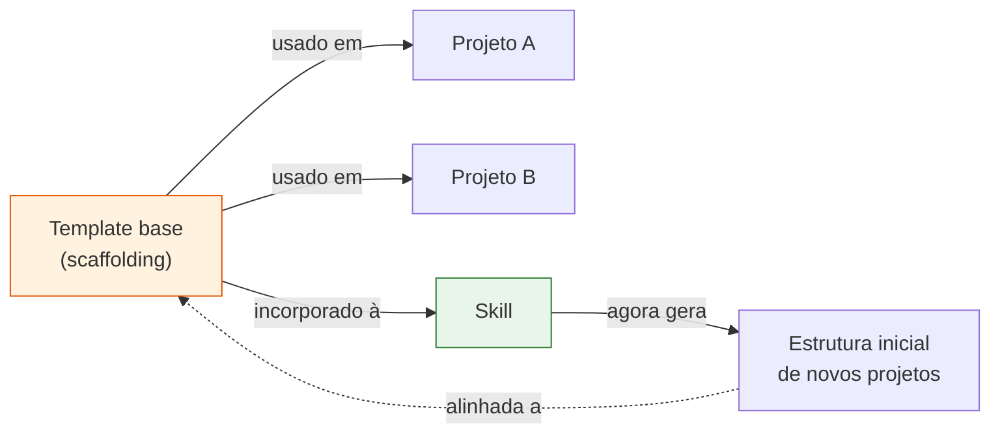

# Requisitos para Criar uma Skill

> **Resumo da aula em formato didático.** Este documento traduz os pré-requisitos e o
> processo recomendado para construir uma *skill* de agente — aquela que codifica as
> decisões arquiteturais do projeto em instruções reutilizáveis pelo agente de IA.

---

## A ideia central em uma frase

> Uma skill **não cria** arquitetura. Ela **codifica** uma arquitetura que você já decidiu.

Pense na skill como o "manual de convenções da casa" entregue a um desenvolvedor sênior
recém-contratado: ele só é útil porque a casa **já tem** padrões definidos. Se o projeto
ainda não decidiu suas camadas, bibliotecas e regras, a skill apenas vai espalhar
suposições do agente como se fossem decisões oficiais.



---

## 1. Definição prévia da arquitetura

Antes de escrever **qualquer** instrução para o agente, defina explicitamente:

| Decisão | Exemplos |
|---|---|
| **Camadas** | `domain`, `application`, `infrastructure`, `presentation` |
| **Componentes** | controllers, use cases, repositories, gateways |
| **Regras de dependência** | "domain nunca importa infrastructure" |
| **Bibliotecas padrão** | ORM, framework HTTP, lib de validação, logger |
| **Organização de pastas** | onde mora cada coisa e por quê |
| **Criação de módulos** | como um novo módulo nasce |
| **Estratégia de testes** | unitário, integração, e2e — e onde cada um vive |

Se o time adota **Clean Architecture, DDD, Hexagonal, MVC, modular ou microservices**,
esse padrão precisa estar **explícito**. Só depois disso a skill consegue transformar
essas escolhas em instruções reutilizáveis.

> ⚠️ **Armadilha comum:** começar a escrever o `skill.md` antes de fechar essas decisões.
> O resultado é uma skill ambígua, porque ela documenta dúvidas em vez de padrões.

---

## 2. Esqueleto mínimo executável (*hello world* de ponta a ponta)

O ponto de partida **não é o sistema completo**, e sim um esqueleto funcional que rode de
ponta a ponta. Esse esqueleto precisa incluir um endpoint **`/health`**, porque o agente
depende de uma forma **objetiva** de verificar se o ambiente subiu corretamente.

### O `/health` não pode ser superficial

Um health check que só responde "o web server está de pé" é insuficiente. Ele precisa
consultar as **dependências críticas**:



Sem isso, o agente não consegue distinguir entre **aplicação realmente operacional** e
**processo apenas iniciado**.

#### Exemplo de resposta esperada

```json
{
  "status": "ok",
  "checks": {
    "database":   { "status": "ok", "latencyMs": 12 },
    "cache":      { "status": "ok", "latencyMs": 3 },
    "messaging":  { "status": "ok" },
    "storage":    { "status": "ok" },
    "paymentApi": { "status": "degraded", "error": "timeout" }
  }
}
```

---

## 3. Health check como apoio ao *harness*

No fluxo de trabalho com o agente, o `/health` deixa de ser apenas observabilidade e
**vira infraestrutura de trabalho** — uma peça operacional do *harness*.

Antes de cada etapa automatizada, o agente pode consultar o `/health`:



**Ganho:** reduz falsos positivos de execução. O agente não tenta testar um endpoint
enquanto o banco está fora, e não reporta "falha na feature" quando o problema real era
o ambiente.

---

## 4. Estrutura objetiva do `skill.md`

O `skill.md` concentra as **regras essenciais** que orientam o comportamento do agente.
O objetivo é dar **contexto suficiente, sem virar um manual exaustivo**.

O arquivo principal deve registrar:

- 🧭 **Filosofia da arquitetura** — o "porquê" das escolhas
- 📐 **Convenções** — nomenclatura, formatação, padrões de código
- 🧱 **Responsabilidades por camada** — o que cada camada pode/não pode fazer
- 🚫 **Regras invioláveis** — limites que nunca devem ser quebrados
- 📄 **Formatos canônicos de artefatos** — como deve ser um controller, um use case etc.
- 🏷️ **Nomenclatura** — convenções de nomes de arquivos, classes, funções
- ✅ **Validação** — onde e como validar entradas
- 🔀 **Distinções importantes** — ex.: `repositories` vs. `queries`
- 🔍 **Checklist de self-audit** — o agente revisa o próprio trabalho
- 📚 **Índice de referências** — aponta para os arquivos de apoio

> 📏 **Regra de ouro do tamanho:** mantenha o núcleo em torno de **algumas centenas de
> linhas**. Quando o arquivo principal cresce demais, a skill perde clareza e fica mais
> difícil de aplicar com consistência.

### Exemplo de distinção `repositories` vs. `queries`

| Conceito | Responsabilidade | Exemplo |
|---|---|---|
| **Repository** | Persistência do agregado de domínio (escrita + leitura por identidade) | `userRepository.save(user)` / `findById(id)` |
| **Query** | Leitura otimizada para a tela/relatório (read model) | `listActiveUsersForDashboard()` |

Documentar essa distinção evita que o agente jogue toda consulta complexa dentro do
repository, "borrando" a fronteira entre escrita e leitura.

---

## 5. Levantamento exploratório com IA (a "entrevista")

Em vez de redigir a skill inteira manualmente desde o início, use a IA em **modo
exploratório** para extrair os requisitos do projeto. Funciona como uma **entrevista
estruturada**.



**Por que isso importa:** o objetivo é transformar o **conhecimento tácito da equipe**
(aquilo que "todo mundo sabe", mas ninguém escreveu) em respostas organizadas. Assim, a
primeira versão da skill nasce de **decisões explícitas**, e não de suposições do agente.

---

## 6. Geração e revisão do primeiro draft

O primeiro draft é **apenas uma versão inicial**, baseada na entrevista e no esqueleto
existente. Ele **precisa** ser revisado.

### O que procurar na revisão

- ❓ **Ambiguidades** — instruções que admitem mais de uma interpretação
- ⚔️ **Conflitos** — duas regras que se contradizem
- 📚 **Excesso de detalhe no arquivo principal** — candidatos a virar referência externa
- 🧩 **Incompatibilidades** — instruções que não batem com a estrutura real do projeto
- 🔁 **Repetições** — a mesma instrução escrita várias vezes

> 💡 **Técnica útil:** peça ao **próprio agente** que revise a skill procurando "regras
> difíceis de seguir, instruções repetidas e trechos que deveriam virar referência
> externa". Como a skill orienta o comportamento do agente, **qualquer confusão no texto
> tende a se refletir diretamente na execução**.

---

## 7. Referências externas e modularidade

Detalhes extensos **não precisam ficar no `skill.md`**. Eles podem ir para arquivos de
apoio, carregados **sob demanda**.



| Fica no `skill.md` | Vai para `references/` |
|---|---|
| Regras invioláveis e convenções | Exemplos longos e completos |
| Responsabilidades por camada | Templates extensos |
| Índice apontando para as referências | Aprofundamentos específicos |

**Resultado:** uma skill **modular** — o essencial fica centralizado e o aprofundamento é
consultado conforme o contexto.

---

## 8. Skill como evolução do *scaffolding*

O *scaffolding* inicial (esqueleto do passo 2) não serve só para começar mais rápido. Ele
fornece a **base concreta** que depois é portada para dentro da skill.



Quando o template base é incorporado à skill, o agente passa a **gerar automaticamente** a
estrutura inicial do projeto, **alinhada ao ambiente real**. A skill deixa de ser apenas
documentação e passa a atuar como **mecanismo de reprodução do padrão** adotado pelo time.

---

## Checklist final — "minha skill está pronta?"

- [ ] A **arquitetura** (camadas, dependências, libs, pastas, testes) está decidida e explícita?
- [ ] Existe um **esqueleto executável** que roda de ponta a ponta?
- [ ] O **`/health`** valida banco, mensageria, cache, storage e serviços externos?
- [ ] O **`skill.md`** cabe em algumas centenas de linhas e cobre filosofia, convenções, regras invioláveis e self-audit?
- [ ] Os **detalhes extensos** foram movidos para `references/` carregadas sob demanda?
- [ ] O draft passou por uma **revisão** (própria e do agente) caçando ambiguidades, conflitos e repetições?
- [ ] O **scaffolding** foi incorporado para que o agente reproduza o padrão automaticamente?

> Quando todos os itens estiverem marcados, você tem uma skill **modular, objetiva e
> operacional** — não um manual esquecido, mas uma peça viva do fluxo de trabalho.
